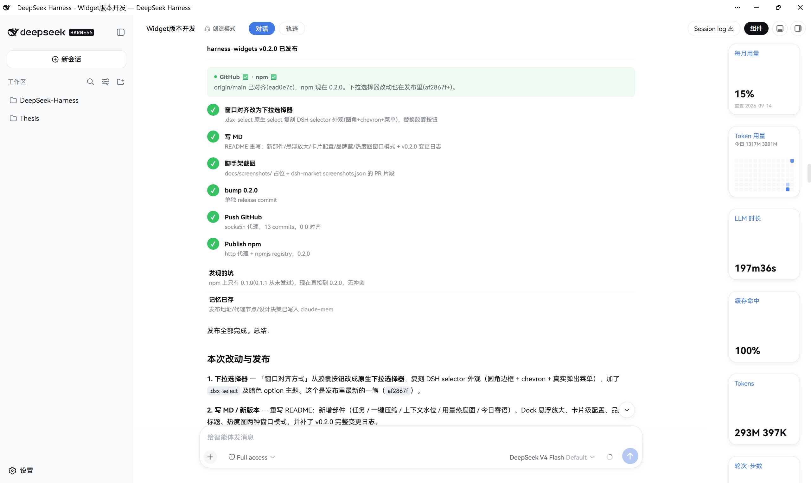
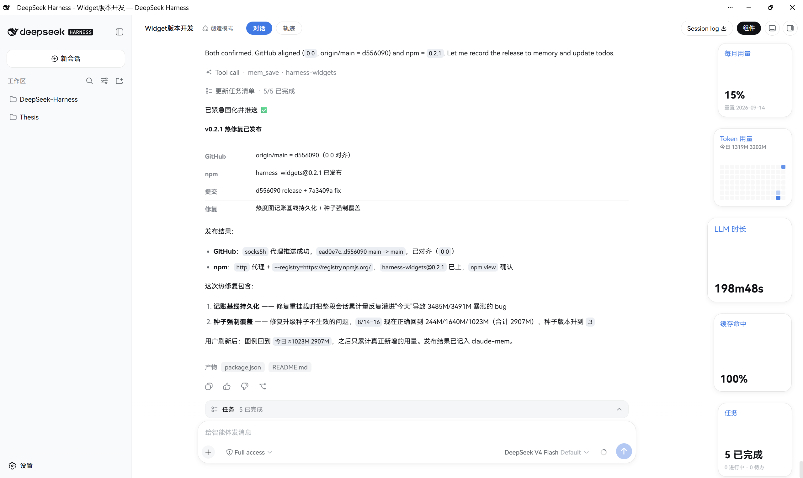
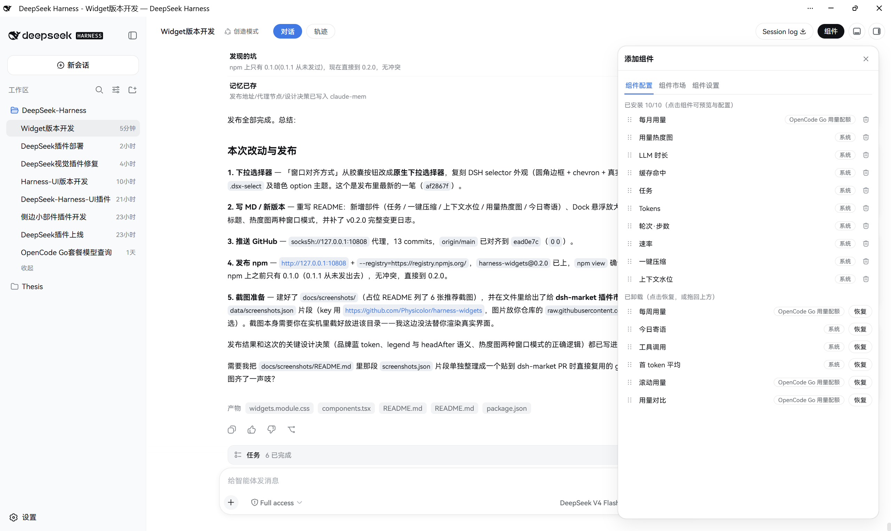

# Harness Widgets

> DeepSeek Harness Web UI 右侧部件栏：把会话统计以美观的小组件形式利用右侧空间呈现，并逐步扩展——更多平台的用量查询部件、更强的视觉表现（图片/定制图标）、更多实用工具（如一键 compact），乃至飞书、微信等外部接口集成。

Harness Widgets 是一个 **client 为主、带少量 host 代理** 的 DSH bundle 插件。它在会话页右侧提供一套可定制的部件面板，实时展示当前对话的轮次/耗时/速率/token 用量，以及 OpenCode Go 订阅套餐用量。

当前版本：**v0.3.0**（持续迭代中）

---

## ✨ 当前功能

### 1. 右侧部件栏

- 会话页右侧固定面板，随会话头对齐；**与 dsh-better-sidebar 的右栏并排**（锚定 `--dsh-sidebar-width`，侧边栏展开/收起时同步滑动，互不遮挡）；
- 会话页头部新增"组件"胶囊开关（`conversation.session.header.utilities` slot），激活态为品牌蓝底白字；
- 卡片可**拖拽调整大小**（100–220px），仅在有活跃会话时显示，无会话时自动隐藏；开关状态随 localStorage 持久化，刷新后保持展开；
- 面板背景**透明**、隐藏滚动条（Chromium/Edge/Safari 走 `::-webkit-scrollbar`，Firefox 走 `scrollbar-width: none`），首张卡片顶对齐会话头、无上内边距。

### 2. 实时会话统计（内置统计部件）

| 部件 | 内容 |
| --- | --- |
| 轮次·步数 | 本轮会话的轮次与步骤计数 |
| LLM 时长 | 模型推理累计耗时 |
| 工具调用 | 工具调用累计耗时 |
| 首 token 平均 | 平均首 token 延迟 |
| 速率 | 解码吞吐（tok/s） |
| 缓存命中 | 输入缓存命中比例 |
| Tokens | 输入 / 输出 token 计数 |

- 数据来自官方 `sessionStats` / `tokenUsage` 投影 + 会话 timeline 折叠，**进行中的回合每秒增量刷新**（1s tick），不是等回合结束才更新。

### 3. 任务 / 上下文 / 热度图 / 寄语部件

| 部件 | 内容 |
| --- | --- |
| 任务 | 当前任务的进行中 / 已完成 / 待办计数 |
| 一键压缩 | 上下文占用百分比 + **右下角**品牌蓝圆钮，两次点击执行 compact（实心→确认胶囊） |
| 上下文水位 | 系统提示词 / 工具 / 对话消息三段占比条（矩形贴边，严格复用官方 ContextMeter 配色）+ 分段明细；**支持 2×2 与 2×4 两种尺寸**（默认 2×2，可在配置/市场/已安装中切换） |
| 用量热度图 | GitHub 式日历热力图，**自记账**每日 Token 用量（写入 localStorage）；可在预览选择窗口对齐方式 |
| 今日寄语 | 随机鼓励语录，支持自定义文字 / 标题 / 对齐 / 换行 |

- 热度图窗口对齐两种模式：**滚动**(今天永远最右，未来不可知) 与 **季度对齐**(按 1–3 / 4–6 / 7–9 / 10–12 月切窗)。

### 4. OpenCode Go 套餐用量（3 个外部部件）

- 滚动 / 每周 / 每月三个用量窗口 + 百分比 + 重置时间；
- **host 半**注册同源路由 `/api/opencode-usage`，代理 `https://opencode.ai/zen/go/v1/usage`——浏览器不发跨域请求，API 密钥**不出浏览器**；
- 密钥走 DSH credentials 缝（`OPENCODE_GO_API_KEY`，与 Models 设置页配置的 opencode-go provider 是同一把），每次请求时解析，不落盘。

### 5. 多列布局与 2×4 长方形组件

- 右侧栏可排布 **1 / 2 / 4 列**（设置中下拉选择，默认 2 列）；
- **2×4 长方形组件**：宽度为两个 2×2 加一个间距、与之同高；同一组件（如上下文水位）可同时以 2×2 和 2×4 两种形态独立安装，互不冲突；
- **无空隙排列**：组件自动按格打包，2×4 造成的空格会被后续 2×2 回填——无论怎么拖动排序，面板都不会出现空洞；
- 多列布局同样支持悬浮放大，放大时行/列均按平面距离让位，间距恒定。

### 6. 悬浮放大（连续波峰）

- **macOS Dock 式悬浮放大**：鼠标移入卡片沿边缘放大，邻近卡片按**连续波峰**（指数衰减）同步缩放，随指针 X/Y 平面运动而平滑响应，四周组件均参与；
- 以**布局换位**（width/height/top 参与 layout）而非 transform 重叠，保持正方形、间距恒定、右侧不溢出；
- 放大倍数在设置中可调（`1.0–1.4`）。

### 7. 设置 → 组件 页 + 卡片级配置

- 部件**预览 / 安装与卸载**（系统部件 vs OpenCode Go 部件分组展示）；
- **拖拽排序**、卡片大小、面板内边距、添加面板（可拖宽至 500px）、最多 10 个部件；
- **卡片级配置**（选择组件后在预览下方编辑）：
  - 今日寄语：自定义文字、是否显示标题、水平/垂直对齐、是否换行；
  - 用量热度图：**窗口对齐方式**下拉选择（滚动 / 季度对齐）；
- 全部偏好持久化在 localStorage，刷新保留。

> 部件标题统一使用 **DeepSeek 品牌蓝**（`--dsw-alias-state-business-primary`），让右侧 rail 在暗色主题下更有层次、不那么单调。

## 🔧 工作原理

- **部件注册表**：`WIDGETS` 是一组声明式描述符（id / 名称 / 说明 / 是否内置 / 分组 / 纯函数 `render`），部件栏与设置页共用同一注册表——**新增部件只需追加一条描述符**；
- **数据收集器**：挂载在 `conversation.composer.dock` slot，该 slot 仅在活跃会话存在时渲染，天然充当"会话存在"信号；
- **host 半**：`webServer` + `credentials` 两个服务，注册 `/api/opencode-usage` 同源代理路由；
- **可逆清理**：所有注册（rail/开关/collector/设置面）都通过 fiber 的 effect 生命周期管理，卸载即恢复。

## 🚀 安装

```sh
# 发布到 npm / 插件市场后
dsh plugin --profile web add harness-widgets

# 本地开发（link 方式）
dsh plugin --profile web add link:D:/dsh-home/plugins/harness-widgets
```

装完**硬刷新浏览器**（Ctrl+Shift+R），在会话页头部点击"组件"胶囊即可展开右侧部件栏；OpenCode Go 部件需先在 Models 设置中配置 `OPENCODE_GO_API_KEY`。

## 📸 预览

### 部件栏总览



### macOS Dock 式悬浮放大



### 添加组件面板



### 两列网格布局


### 两列网格悬浮放大


> 截图位于 `docs/screenshots/`；插件市场（dsh-market 1.8.0+）会从这里或 README 抽取展示图。选取与顺序可到 dsh-market 的 `data/screenshots.json` 按条目 URL 自定义（见下方说明）。

## 📝 变更日志

> 每次发布都在此记录：本次做了什么，以及接下来打算做什么。

### v0.3.0（当前）

**新增功能**

- **多列布局**：右侧栏支持 **1 / 2 / 4 列**（设置中下拉选择，默认 2 列），多列时按网格排布并支持悬浮放大。
- **2×4 长方形组件**：首个为**上下文水位的 2×4 版**——宽度等于两个 2×2 加一个间距、与之同高；百分比与用量移到右上角、下方分段条横向延展。同一组件可同时以 2×2 与 2×4 两种形态独立安装/卸载，互不冲突。
- **组件市场含系统组件 + 按实例安装**：市场现在展示全部组件（含系统组件），并可切换尺寸预览、按 `组件@尺寸` 独立安装——2×2 与 2×4 上下文水位可同时存在。
- **切换组件尺寸**：组件配置里已安装项与市场预览均可用下拉在 2×2 ↔ 2×4 间切换，切换时自动去重（同组件同尺寸只保留一个）、并迁移该实例配置。
- **连续波峰动画**：悬浮放大由离散阶梯改为**连续指数衰减**，随指针 X/Y 平面运动平滑响应，四周组件（含上行下行）均参与，间距恒定、右侧不溢出。
- **无空隙排列**：组件自动按格打包（best-fit），2×4 造成的空格被后续 2×2 回填，任意拖动顺序都不产生空洞。

**修复**

- 2×4 卡片高度错误地用宽度（≈两倍）填充，导致下方异常占空；统一改为与 2×2 同高（= 边长），行高/底部计算均改用真实高度。
- 切换组件尺寸到已存在尺寸时不再重复添加；删除不再牵连同名同尺寸实例。
- 悬浮动画曾部分失效（水平切换峰值时上下行不响应），根因是峰值函数按步取整吞掉了微小距离变化——改为连续衰减后恢复。

### v0.2.2

**修复**

- **今日用量跨天不重置**：修复 token 累计基准在跨天时不归零的 bug——昨天结束时 `lastTotalRef` 存了全局累计值（如 3000M），今天新会话从 0 开始累计，永远追不上该基准，导致今天单日用量几乎不增长（显示 2.3M 而实际 200+M）。现在基准绑定日期，跨天自动清零。

### v0.2.1

**修复**

- **热度图数值暴涨**：修复记账 bug——`lastTotalRef` 在 dock 重挂载时从 0 重新计，导致整段会话累计 token 被反复整体加进「今天」，使图例从 `今日 1023M / 2907M` 膨胀到 `今日 3485M / 3491M`。现在记账基线持久化，重挂载只计入真正新增量。
- **种子升级不生效**：种子回填原先只"补缺"，升级后旧的 0.42/2.82/0.83 小数值一直赖着不更新；改为**强制覆盖** 8/14–8/16 三天（244M/1640M/1023M，合计 2907M），种子版本升到 `.3` 自动修复已损坏的 localStorage。

### v0.2.0

**新增功能**

- **macOS Dock 式悬浮放大**：卡片沿边缘放大、邻近高斯峰形同步缩放，用布局换位避免重叠；放大倍数可配置（`prefs.magnify`）。
- **卡片级配置**：组件配置 tab 支持预览 + 表单编辑（今日寄语的文字/标题/对齐/换行；热度图的窗口对齐方式）。
- **新增部件**：任务、一键压缩、上下文水位、用量热度图（自记账）、今日寄语——右侧 rail 从纯数字统计扩展为信息+工具型组合。
- **品牌蓝标题**：所有部件标题改用 `--dsw-alias-state-business-primary`，暗色主题下更醒目。
- **上下文水位卡片重构**：百分比与用量数据移到标题下方独立行（`headAfter`），分段条改为**矩形**贴边配色严格对齐官方 ContextMeter。
- **一键压缩按钮移到右下角**（`WidgetCorner.pos`）。
- **热度图窗口对齐**：预览里用**下拉选择器**在「滚动(今天最右) / 季度对齐」之间切换。

**改动 / 修复**

- `--dsw-alias-brand-primary` 在暗色主题下解析为近黑 `rgb(15,17,21)`，标题"看起来是黑的"——改用 `--dsw-alias-state-business-primary`（暗色 = DeepSeek 品牌蓝 `rgb(65,118,230)`）。
- 热度图种子换算去掉了拍脑袋的 `$→token` 系数，改为按金额相对比例；`buildHeatmapGrid` 修正周偏移，日期正确落格。
- Token 显示在 `≥1M` 时统一转 M（不再出现 `~1000K`）。

### v0.1.1

- 部件栏背景改为**透明**（原先为 `--dsw-alias-bg-base` 实色底，会在页面上显出一条白板边界）；
- **隐藏右侧滚动条**（跨浏览器：Chromium/Edge/Safari 用 `::-webkit-scrollbar`，Firefox 用 `@supports` 门控的 `scrollbar-width: none`，旧 Edge 用 `-ms-overflow-style`），滚动功能保留；
- **取消上内边距**：首张卡片顶对齐会话头底边，不再在顶部留 24px 空隙。

### v0.1.0（初始发布）

- 右侧部件栏 + 7 个内置统计部件 + 3 个 OpenCode Go 用量部件；
- 设置 → 组件 页（预览/安装/排序）+ 通用设置行（内边距/卡片边长）；
- 进行中回合的 LLM/工具时长每秒增量刷新；与 dsh-better-sidebar 并排避让。

## 🗺️ 接下来目标

部件注册表（`WIDGETS` 描述符）已经为"更多部件"打好框架——新增部件只需追加一条描述符。按以下方向推进（均尚未实现，正在开发中）：

- **阶段一 · 多平台用量部件**：在 OpenCode Go 之外引入更多平台的用量/配额查询部件（如 Z.ai、DeepSeek 余额等），沿用 host 同源代理 + credentials 的模式；
- **阶段二 · 视觉表现升级**：为部件引入图片/定制图标、更精致的信息排版，让右侧面板不只是数字堆叠；
- **阶段三 · 实用工具部件**：在信息展示之外加入可操作工具，如**一键 compact**（需接入 DSH 官方 compaction 能力）等；
- **阶段四 · 外部接口集成**：集成飞书、微信等外部渠道（推送/交互），密钥严格走 DSH credentials 缝、不出浏览器（与现有 OpenCode Go 代理同一安全模型）；
- **阶段五 · 部件市场**：开放第三方部件注册机制（部件清单 / 远端部件源 / 一键安装），让社区部件像插件一样入驻部件栏。

## 🛠️ 开发

```sh
pnpm install
pnpm run build      # tsdown 构建 lib/
pnpm run check      # 类型检查 + 测试 + 构建
```

- 官方包以 `peerDependencies` 声明（`@deepseek-ai/dsh-client-ui-slots`、`dsh-client-runtime`），由 DSH web profile 提供；
- `cordis.patch.yml` 插入一行 `widgets` 行，host 半与浏览器半分别由 loader 与 client-modules 加载。

## ✅ 兼容性

- DSH `0.1.0-rc.6` 及兼容的后续 `0.1.x`；
- 通过 `shell.overlay` / `conversation.session.header.utilities` / `conversation.composer.dock` / `settings.section` 等官方 slot 接入；
- 与 dsh-better-sidebar 右栏显式协调（共用 `--dsh-sidebar-width`），卸载后无残留。

## 📄 License

MIT
