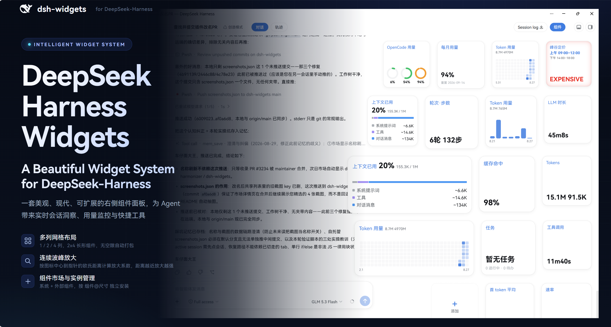

<p align="right"><a href="README.md">English</a> · <b>简体中文</b></p>

<h1 align="center">DeepSeek-Harness Widgets</h1>

<p align="center">
  <strong>为 DeepSeek Harness 打造的美观、可扩展的右侧组件系统。</strong><br>
  多列网格布局 · 2×4 长方形组件 · 连续波峰悬浮放大 · 组件市场与实例管理
</p>

<p align="center">
  
  
  <a href="https://github.com/Physicolor/dsh-widgets/stargazers"></a>
  
  
</p>

<p align="center">
  
</p>

DeepSeek-Harness Widgets 是一个基于 Cordis 的 DeepSeek Harness **持久 bundle 插件**。它在会话页右侧提供一套可定制的多列组件面板，实时展示对话洞察、用量监控与快捷工具，并通过声明式注册表支持无限扩展。

## 官网 / Showcase

项目官网位于 [`website/`](website/)（纯 HTML/CSS/JS，无构建步骤，全部相对路径，可直接发布到 GitHub Pages **https://physicolor.github.io/dsh-widgets/**）：介绍 dsh-widgets 是什么、为什么要做、全部 19 个正式 Widget 的真实展示与 Live Playground、Widget 单元化架构、生产 Workflow，以及「需求表 → Widget Specification」生成器。自包含验证脚本 `node website/verify.mjs`（静态检查 + Edge 无头浏览器验证）。部署方式见 `website/README.md`。

---

## 当前功能

### 多列网格布局

| 项目 | 说明 |
| --- | --- |
| 列数 | 1 / 2 / 4 列可选（设置中下拉，默认 2 列） |
| 2×4 长方形组件 | 宽度为两个 2×2 加一个间距，与 2×2 同高；同一组件可同时以两种尺寸独立安装 |
| 无空隙排列 | 组件按格自动打包（best-fit），2×4 造成的空格由后续 2×2 回填，拖动排序始终无空洞 |
| 悬浮放大 | 多列网格同样支持，放大时行/列均按平面距离让位，间距恒定 |

### 连续波峰悬浮放大

macOS Dock 式悬浮放大，提供两种模式（在 **设置 → 组件 → 无极变化** 中切换）：

- **无极变化（连续跟随）**：真正无极——每张卡片的缩放由其自身到指针的连续欧氏距离决定，指针任意移动时波峰在卡片间平滑滑动。它每一帧直接落位到稳态右对齐几何（`transition: none`），因此即使在移动中卡片右缘也恒贴 rail 右侧，不会出现宽度/位置失步导致的右缘越界。
- **离散（默认）**：复用同一套连续几何，仅把指针坐标量化到离散格点（行/列中心 + 相邻中点：2·行数−1 个 Y 点、2·列数−1 个 X 点），由 0.2s 补间在格点间平滑移动波峰。

两种模式下放大后的组件层都由悬浮层绘制在 rail 滚动裁剪盒**之外**，向左放大不吸附不截断，同时 resting rail 宽度与对话区距离始终保持不变。缩放保持正方形与恒定间距；放大倍数可在设置中调节（`1.0–1.4`）。

### 内置部件

| 部件 | 说明 |
| --- | --- |
| 轮次·步数 | 会话轮次与步骤计数 |
| LLM / 工具时长 | 推理与调用累计耗时 |
| 首 token 延迟 | 平均 TTFT |
| 速率 | 解码吞吐（tok/s） |
| 缓存命中 | 输入缓存命中比例 |
| Tokens | 输入 / 输出 token 计数 |
| 上下文水位 | 系统/工具/消息三段占比条 + 明细；支持 2×2 与 2×4 两种尺寸 |
| 一键压缩 | 上下文占用百分比 + 右下角圆钮（双击执行 compact） |
| 任务 | 进行中 / 已完成 / 待办计数 |
| 用量热度图 | GitHub 式日历热力图，自记账每日用量 |
| 今日寄语 | 随机鼓励语录，可自定义文字/对齐/换行 |

### 组件市场

- 展示全部组件（系统 + 外部），支持搜索、尺寸切换预览、按 `组件@尺寸` 独立安装；
- 已安装列表支持拖拽排序、配置编辑、`2×2 ↔ 2×4` 一键切换（自动去重，同组件同尺寸只保留一个）；
- 组件配置 tab 支持卡片级自定义（今日寄语、热度图窗口对齐等）。

### OpenCode Go 用量

滚动 / 每周 / 每月三个用量窗口 + 百分比 + 重置时间。Host 半注册同源路由代理 `opencode.ai`，浏览器不发跨域请求，密钥走 DSH credentials。提供两种展示：**用量对比**（三窗口柱状图）与 **用量环图**（三窗口环形图，环中心百分比 + 悬停精确值，按同一紧急度配色）。

### 峰谷定价（市场组件）

仅 2×2 的「峰谷定价」卡片，实时显示当前是否处于 DeepSeek V4 高峰计费时段。高峰时段（北京时间 UTC+8）为工作日 **09:00–12:00** 与 **14:00–18:00**，其余所有时间（含周末）均为低峰。低峰时左下角显示 **CHEAP**；处于高峰时段时，整卡泛起呼吸式的红色内晕（非整块实填，中央内容始终清晰可读）并显示 **EXPENSIVE**，标题下方对应时段行同步亮起品牌蓝并微微放大。时段目前硬编码，自定义时段设置已列入 Roadmap。

---

## 工作原理

- **部件注册表**：`WIDGETS` 声明式描述符（id / 名称 / 尺寸 / 分组 / render），部件栏与设置页共用同一注册表，新增部件只需追加一条描述符；
- **数据收集器**：挂载在 `conversation.composer.dock` slot，该 slot 仅在活跃会话存在时渲染，天然充当「会话存在」信号；
- **Host 半**：`webServer` + `credentials` 两个服务，注册 `/api/opencode-usage` 同源代理路由与 `/api/widgets-state` 状态存储（组件栏配置持久化到 `profiles/web/dsh-widgets-state.json`——权威副本，浏览器换 origin、无痕模式、站点数据被清都丢不了）；
- **可逆清理**：所有注册通过 fiber 的 effect 生命周期管理，卸载即恢复；
- **Slot 接入**：`shell.overlay`（面板）、`conversation.session.header.utilities`（胶囊开关）、`settings.section`（设置页）。

## 安装

```sh
# 通过 npm（插件市场）
dsh plugin --profile web add dsh-widgets

# 本地开发（link 方式）
dsh plugin --profile web add link:D:/dsh-home/plugins/harness-widgets
```

安装后**硬刷新浏览器**（Ctrl+Shift+R），在会话页头部点击「组件」胶囊即可展开右侧部件栏。OpenCode Go 部件需先在 Models 设置中配置 `OPENCODE_GO_API_KEY`。

## 开发

```sh
pnpm install
pnpm run build      # tsdown 构建 lib/
pnpm run check      # 类型检查 + 测试 + 构建
```

- `peerDependencies`：`@deepseek-ai/dsh-client-ui-slots`、`dsh-client-runtime`（由 DSH web profile 提供）；
- `cordis.patch.yml` 插入一行 `widgets` 行，host 半与浏览器半分别由 loader 与 client-modules 加载。

## 兼容性

- DeepSeek Harness `0.1.0-rc.6` 及兼容的后续 `0.1.x`；
- 通过 `shell.overlay` / `conversation.session.header.utilities` / `conversation.composer.dock` / `settings.section` 等官方 slot 接入；
- 与 `dsh-better-sidebar` 右栏显式协调（共用 `--dsh-sidebar-width`），卸载后无残留。

## 变更日志

### v1.4.1

> 本次发布包含整棵工作树：**系统监控组件族**（下）、**侧栏抽屉动画**、**用量一位小数修复**（此前未发布的 v1.4.2 / v1.5.0 工作记录）。

**系统监控组件族（本机设备信息）：**

- 🖥️ **新增 5 个设备信息组件**（市场「设备状态」分组——与 DeepSeek Harness 自身的「系统」分组区分）与 host 路由 `/api/sysinfo`（CPU 利用率 = 两次轮询间 `os.cpus()` 增量采样、内存 = `os.totalmem/freemem`、GPU = 单次 `nvidia-smi` 查询，~1 秒缓存 + 120 点采样历史）：`sys-cpu`（CPU 利用率大数字 + 内存占用行）、`sys-gpu`（显存大数字 + 利用率/温度，不显示型号，大数值保持左下角）、`sys-rings`（CPU/GPU 利用率双环形图）、`sys-board`（2×4 综合看板：CPU/内存/GPU 利用率/显存四环 + 标题行右端 GPU 短型号与温度，无 0/0 GB 冗余行，环下数值与名称同行如「43% CPU」）、`sys-gpu-line`（GPU 利用率折线：Windows 任务管理器风格面积折线，底角首尾时间标签；**采样窗口 10–30 点可选、默认 20**（组件配置下拉），只画最近 N 点避免折线无限压缩；client 侧自积累历史回退——旧 host 也能画线，host 重启后自动切回长历史）。共享逻辑收在 `src/client/lib/sys-view.ts`。
- ⏱️ **每组件可设刷新间隔**（组件配置）：5 / 10 / 30 / 60 秒预设 + 自定义秒数，默认 10 秒；collector 按已装 sys-* 实例的**最短间隔**轮询（钳制 5–60 秒），host 侧 ~1 秒缓存保证同一时刻多个组件只 spawn 一次 `nvidia-smi`。
- 🚫 **CPU 温度刻意不做**（先调研后舍弃）：Windows 无免特权稳定 CPU 温度源（WMI 热区在多数主板不可用——本机已实测读不到；LibreHardwareMonitor 属外部运行时依赖）。GPU 温度经 `nvidia-smi` 开箱即用；无 NVIDIA GPU 时组件优雅降级（「未检测到 NVIDIA GPU」）。
- 🔄 **sys-gpu / sys-cpu 大数字切换**：整卡点击循环（GPU：显存 → 温度 → 利用率；CPU：利用率 → 内存），组件配置下拉「大数值显示」同步；`cycle.store` 字段使系统组件的循环与用量池视图互不干扰。
- 🎨 排版：用量环图环下仅百分比（不再显示 滚动/周/月 文字）；环形图环与下方文字 4px 间距（柱状图节奏）；折线图与底角时间标签 3px 间距。
- 🛡️ **P1 崩溃修复**：usage 窗口裸访问（`u.rolling.percent`）遇畸形负载即抛错、整条 rail 消失——现已双层防护（窗口级 `winPct()` 降级 + 每卡渲染 try/catch 隔离），任何单卡异常不再隐藏其他组件。
- ✅ 新增自包含验证：`docs/verify-sysinfo.mjs`（host 路由形状/缓存/增量/历史，12 项）、`docs/verify-usage-guard.mjs`（崩溃防线回归，5 项）、`docs/probe-sysinfo-live.cjs`（运行中服务探测）。

### v1.3.3（插件 — OpenCode 用量实时刷新）

- 🔄 **OpenCode 用量不再「仅挂载拉一次」**：用量组件族（用量对比 / 环形 / 滚动 / 每周 / 每月）此前只在 collector 挂载时 fetch 一次，而 `conversation.composer.dock` 在会话间被组件复用——刷新或新建会话才会重新挂载，导致继续对话/切换会话后用量停留在旧值。现在 collector 在**每次对话完成（`running` true → false）时重新拉取** `/api/opencode-usage` 与 `/api/opencode-usage-multi`（多 Key 池），回合结束后配额扣减即时上卡，无需刷新；进行中的回合不会重复请求。

### v1.2.3
**性能 — 右面板开合动画掉帧修复（与 dsh-better-sidebar / dsh-ui-harmonizer 协同）：**

- 🧊 rail 与放大 overlay 的侧移从 `right` 属性动画改为**合成器 transform 平移**（`translateX(calc(var(--dsh-sidebar-width) * -1))`，`right:0`）：better-sidebar 面板开合时 rail 整树在合成层平移，卡片/热力图零逐帧 reflow；之前 `transition: right` 每帧重排整个 rail 子树，与对话列的 margin 动画叠加后随对话 DOM 规模掉帧，且两过渡相互不同步。
- 🗑️ 移除卡片 slot 常驻 `will-change: top,width,height`：此前两套 deck（静态+放大层）× N 张卡片全部常驻独立合成层，膨胀 GPU 内存与每帧合成成本；短 tween 由浏览器自动提升层，无需常驻。
- ✂️ 放大 overlay 卡片体改为**仅在真正放大时渲染**（slot div 常驻保持几何 tween 无缝）：静息时 rail 常驻 DOM 减半（热力图等重组件不再双份渲染）。
- 🔗 与 dsh-better-sidebar / dsh-ui-harmonizer 保持同变量同 duration/easing（`--dsh-sidebar-width` + `--ds-transition-duration-slow` + `--ds-ease-in-out`）；拖动（`body[data-dsh-sidebar-dragging]`）仍即时跟随；`prefers-reduced-motion` 关闭过渡。

**掉帧数值对比（playwright + 本机 Edge 实测，better-sidebar 右面板开合动画窗口）：**

| 场景 | 修复前 | 修复后 |
| --- | --- | --- |
| 重会话动画掉帧率（帧间隔 >26ms 占比） | 20–31% | ≈ 0–1.4%（rail 开/关/禁用动画三者无差异，即噪声） |
| 主线程长任务 | 每动画多达数个、单次 60–210ms | 0 |
| 组件栏开启 vs 关闭之差 | 明显（打开即卡） | 无差异（开启 = 零额外成本） |
| 滑动路径 | `right`/`margin` 逐帧 layout（全树 reflow） | transform 合成平移（合成器） |
| 常驻合成层 | 每卡片 × 双层 deck 全部常驻 | 0（tween 自动提升、结束即释放） |

→ 组件栏开启引入的掉帧从「每动画丢约 1/3 帧 + 数百 ms 长任务」**降到 0**：组件常开下开关右面板与关闭组件时同样丝滑（典型会话全程 60fps）。重会话（数千 DOM 节点）下对话列宽度过渡仍约 ~10% 掉帧——与组件无关（关闭组件同样存在、属 UI 协调层），已列入 Roadmap。

- ✔️ 自包含验证 `scripts/verify-sidebar-anim.cjs`（playwright-core + 本机 Edge，连 3080）：rail `transition-property=transform`；面板开合后 rail 右缘 = 视口宽 − 面板宽；消融测试——禁用 rail / 对话列动画后掉帧 1.4% / 0.6%，证明 rail 侧贡献已归零。

**新增 — 多 Key 用量联动（配合 dsh-multikey-pool）：**

- 🔑 新 host 端点 `/api/opencode-usage-multi`：解析全部池内 Key（`OPENCODE_GO_API_KEY` 主 + `OPENCODE_GO_POOL_2..9` 备用）逐把拉取用量，并计算「共同用量」total（滚动/周/月各窗口按可用 Key 数量比例取平均，状态与重置跟随用量最高的一把）。
- 🔄 用量环图 / 用量对比 / 滚动用量 / 每周用量 / 每月用量组件支持**单击整卡循环切换视图**：总 Key → Key 1 → Key 2 → … → 总 Key；当前视图以 legend 形式写在大标题正下方（「总 Key」「Key 1」「Key 2」……），切换选择经 `cardConfigs.<实例>.poolView` 持久化，跨刷新与跨浏览器保留。
- 🍩 按压弹性动画：可点击组件按下瞬间 scale(0.93) 快进慢出，松开以弹簧曲线回弹（`cubic-bezier(0.34,1.56,0.64,1)`），符合官方按钮手感；`prefers-reduced-motion` 不受影响。
- 🎯 点击与真实使用联动：切到 Key N 时同步通知多 Key 池把该 Key 设为主力（`/api/multikey` prefer），切回总 Key 自动解除手动优先——「看到的」就是「正在用的」。
- 🧩 单 Key 环境自动退化为原行为：池内只有主 Key 时组件照常显示主 Key 数据，不出现切换交互。

**新增 — 全面中英文适配（跟随 设置 → Language 即时切换，无需刷新）：**

- 🌐 接入官方 `locale` 服务（`ctx.get('locale')`）：全部 UI 文案改为字典驱动——设置页（组件配置/组件市场/组件设置）、右侧组件栏（卡片标题/数值/legend/角落按钮/添加钮/aria）、组件市场卡片、configSchema 表单、峰谷定价窗口、任务/上下文/寄语卡片、OpenCode 用量（总 Key/循环/重置）等均有英文译文；`locale` 服务缺席时自动回退内置 zh/en 字典（探测口径与官方一致：localStorage `dsh-language` → `<html lang>` → `navigator.language`）。
- 🔑 修复：`installLocale` 现在把 zh/en 字典**注册**进官方 `locale` 服务（`register(ns, locale, dict)`）再 `bind`——此前只 bind 未注册，界面会把字典 key 原文（如 `ui.capsule`、`card.contextWater.system`）直接显示出来；注册后按 active locale 正确取词，不再出现裸 key。
- ♻️ 常驻 UI（右侧栏、页头胶囊）订阅 `locale/change` 立即重渲染；设置页导航名「组件」改为 **label thunk**（`SlotLabel` 契约），语言切换后导航自动更新，无需重新注册。
- 📖 每个组件的名称/描述/徽标/预览切换标签支持中英双语；`WIDGETS` 的 name/desc/badgeLabel/simToggle/configSchema 改为 thunk，渲染时按当前语言取值。
- 🧩 零硬依赖：未装载 `locale` 服务的组合自动走内置字典，行为与之前一致。
- ✔️ 自包含验证 `docs/verify-i18n.mjs`（Node `--experimental-strip-types` 直接跑）：双语切换、无裸 key、卸载回退全绿。

### v1.2.2
**新增 — 峰谷定价组件：**

- ⏱️ 市场新增「峰谷定价」组件（仅 2×2）：实时显示当前是否处于 DeepSeek V4 高峰计费时段。时段硬编码为北京时间工作日的 **09:00–12:00** 与 **14:00–18:00**（对应官方 UTC 01:00–04:00 / 06:00–10:00），其余时间含周末均为低峰；自定义时段设置已列入 Roadmap。
- 💰 左下角大标签与缓存命中 / Tokens 组件同款字体字号与位置：高峰时段显示红色 **EXPENSIVE**，低峰显示 **CHEAP**。
- 🟥 高峰时整卡泛起呼吸式**红色内晕**（方案 B：四边向内晕染，中央内容保持清晰，非整块实填），节奏 2.2s、幅度克制，只传递"抓紧时间"的紧张感，不做任何点击引导；`prefers-reduced-motion` 用户得到静态稳定红晕。
- 🔵 标题下方两行时段字体与 Tokens 用量下方标签同款：当前所在时段行亮起品牌蓝并微微放大（10px→12px、500→600），另一行保持弱化。
- ⏲️ 新增 30s 常驻心跳：即使没有回合在跑，stats 也会定期重建，峰谷状态在窗口边界准时翻转（此前秒级刷新只在回合运行时存在）。

**新增 — OpenCode 用量环图组件：**

- 🍩 市场新增「用量环图」（usage-rings，OpenCode Go 分组）：滚动 / 周 / 月三个窗口各一个环形图并排展示，信息与「用量对比」柱状图等价、形式为圆环。
- ⭕ 环中心保持干净（不放文字），因此环条可以画得又粗又满（stroke 5px、环径最大化）；每个环的百分比以较大字号显示在环正下方，窗口名与精确值由悬停 title 提示（紧急度配色与柱状图一致：≥95 红、≥75 黄、其余绿）。环与环间距与卡片内边距一致（2×2 即 12px），与内边距同一节奏，环径随之收紧以保持三环并排；数字与环的间距略大于常规贴合（4px），便于后续 2×1 等宽卡排版沿用。
- 🧭 原「用量对比」柱状图保留不动，两种展示并存、皆可独立安装。

**变更 — OpenCode 用量对比柱状图改为符合数据可视化惯例的比例：**

- 📊 「用量对比」（usage-bars）三根柱子不再使用固定的 ~12px 宽度加 `space-around` 均分空隙。每根柱子的列改为弹性等分卡片宽度（与「用量柱状图」每日 Token 柱同一套弹性列布局），柱间间距统一为相同的 4px，每根柱子以所在列约 60% 的宽度渲染——2×2 卡片下约 24px，与 56px 柱高比例协调（100% 满宽的版本视觉上像贴在一起的色块）。
- 🟣 柱子四角全部改成 5px 圆角——没有底部轨道的情况下直角底显得过于尖锐。
- 📏 柱子上不贴数值（迷你图惯例——三根小柱上贴数字属于 chartjunk）；精确百分比在悬停时通过原生 title tooltip 呈现，同时柱后叠加极淡的 25/50/75% 虚线参考线，不悬停也能按四分之一刻度目测每根柱子的高度。

**改进 — 预览状态切换 + 下拉箭头深色修复：**

- 🖱️ 有状态的组件（现为「峰谷定价」）在「组件配置」与「组件市场」的预览里可直接**点击卡片切换状态**（高峰/低峰），不必等到真实时段即可预览 EXPENSIVE 红色内晕与 CHEAP 两种形态；预览区同步显示「点击卡片切换：高峰/低峰」提示（该能力通过 `simToggle` 描述符声明，后续有状态组件只需加一行）。
- 🔽 修复 `.dsx-select` 下拉箭头在深色模式下不显示/不随主题的问题：箭头 SVG 作为 background-image 时 `fill='currentColor'` 不会渲染（SVG 背景图在独立图像上下文解析，currentColor 无效），改为两套显式填充——浅色模式深灰、深色模式（`body[data-ds-dark-theme]`）近白。

**修复 — 深色模式下实心操作按钮文字重新可见：**

- 🌗 实心主按钮（`dsx-btn-primary`——「已添加 / 添加 / 查看详情」）、「组件」状态胶囊的按下态、以及组件卡片内的操作按钮（primary/danger 两类）此前都用 `var(--dsw-alias-brand-primary)` 作背景并硬编码白色文字；深色模式下品牌主色渲染为近白色，文字与背景同色、完全看不见。现统一改为：primary 用 `var(--dsw-alias-state-business-primary)`、danger 用 `var(--dsw-alias-state-error-primary)` 作背景——与官方 UI 实心操作按钮同一组 token，深浅两套主题下白字均清晰可读。

**修复 — Better Sidebar 右侧边栏开启时添加面板高度不再塌缩一半：**

- 📐 添加面板的 `bottom` 此前错误地跟随 `--dsh-sidebar-width`——那是 better-sidebar 用来把 `#root` 右推的**面板宽度**变量；右侧边栏一开（如 320px），bottom 被抬升整整一个面板宽度而 top 固定，可见高度直接减半，且与先开哪边无关。现改为锚定输入框底部留白（`--dsx-input-bottom`，本就是 rail 测量注释里声明的意图）——右侧偏移仍跟随侧栏，竖直偏移永不跟随。无头实测：侧栏关闭 / 320px / 480px 三种状态下面板高度完全一致（旧规则在 320px 时 886→566px）。

**修复 — 1 列布局下 2×4 组件正确屏蔽：**

- 🧱 1 列模式下 2×4 宽卡片（占两格）无处安放。现在 rail 会隐藏已安装的 2×4 实例（暂时屏蔽、非删除——切回 2/4 列原样恢复），并市场同步提示：2×4 条目标题加删除线、右侧显示黄色「1列不可用」胶囊、添加按钮禁用。
- 🧪 无头端到端实测：2 列下添加 heatmap@2×4（324px 宽槽）→ 切 1 列 → 标题划线 + 黄色胶囊 + 添加禁用 + rail 无宽槽（仅 150px）；结束后已还原用户状态。

### v1.2.1
**修复 — 页面关闭时把最后一次修改同步冲入 host 存储，组件状态在任何桌面壳、任何浏览器/设备下都不再丢失：**

- **根因**。组件配置双通道写入：`localStorage`（快速路径）+ 经 **400ms 防抖** PUT 到 `/api/widgets-state` 的 host 文件（权威、跨 origin）。防抖写入**没有关闭前 flush**：若窗口/标签在 400ms 窗口内（或 PUT 仍在途时）关闭，请求随页面一起被销毁。而采用「每次启动随机回环端口」的桌面壳（如 DSH Desktop 各版本）每次启动的 `localStorage` 都是全新 realm——这一记漏掉的 PUT 就意味着修改永久丢失，表现为「桌面端改完不保存」；固定的本地 web 端口（origin 稳定）则把同样的缺陷隐形掩盖。
- 💾 **关闭前 flush**。新增 `pagehide` 监听，页面开始销毁瞬间调用 `flushPendingState()`：把尚未到达 host 存储的状态用 `navigator.sendBeacon` 送出（页面销毁时浏览器仍会投递），并以 keepalive fetch 兜底；host 路由本就同时接受 PUT 与 POST，同一端点即可承载。改完立刻关闭，修改不再丢失——任何桌面壳、浏览器 origin、无痕模式、清除站点数据的会话都适用。
- 🛡️ 防抖 PUT 同步加 `keepalive: true`：已在途的写入同样能活过页面销毁。
- 🧪 无头浏览器对真实 host 存储做端到端实测：胶囊点击（真实 `setPrefs` → `saveState`）后**立即** `pagehide`（约 80ms，远在 400ms 防抖之内）→ 真实 beacon 发出；host 文件 `savedAt` 前进并等于 `localStorage`；防抖 fetch 不再重复触发；测试最后已还原用户的真实状态。

### v1.2.0
**修复**
- 🗓️ 热度图不再把昨天会话的整段累计误记进今天：fallback 锚点现在跟随按步记账的累计，且仅当活跃会话今天确实产生了 step 时才做差值记账（此前重开昨天的会话、或新建会话瞬间投影滞后，会把整段历史——如 106M——diff 进今天的格子）。
- 🌐 热度图按「记账时区」划分天（热度图卡片配置中新增，默认北京 UTC+8，即本地 08:00 才跨天）。选项：北京 (UTC+8) / 跟随系统 / UTC。此前按浏览器时钟，系统时区不是 UTC+8 时日界线会偏移 8 小时。
- 🧹 一次性清理：清除已被污染的今天格子，交由实时记账干净重建。
- 📊 用量柱状图改为「窗口内归一化」：柱高按**当前显示的 7 天窗口内**的最大值缩放（滚动与周对齐都生效），本周最大的一天总是达到满高、其余按比例——即使历史存在巨大 outliers（如 1.2G 的某天），近 7 天窗口也不会被压扁，图表保持饱满。

### v1.1.6
**修复 — 悬浮以卡片为锚点、添加按钮随波（含位置）、进出平滑**

- **触发以卡片为准（两种模式统一）**：只有指针真正悬浮在卡片上才触发；在卡片间空隙过渡时不熄灭，且**波峰继续跟随指针滑动**（离散模式量化到格点，跨空隙移动依然变化；实时模式每帧跟随）；只有离开组件区域才停止。
- **添加按钮随波且位置一起动**：它的摆放位置从放大后的行布局重算——上方卡片变高时它随放大后的 deck 底部/最后行空隙一起下移，并在该位置按同一钟形曲线放大（此前只有尺寸缩放、位置钉在静息网格）。
- **最右侧恒对齐、间距恒一致**：悬浮层卡片的位置（top/right）全程即时；无极（realtime）跟随期**尺寸过渡整段禁用**——每帧直接落稳态 right 贴齐几何，快速移动也不会停留在非稳态中间姿态（这正是历史上右缘漂移与组件间距不一的根因）。进入/退出阶段（以及离散模式的格点滑动，其目标以格点频率变化）保留 0.15s 宽高补间实现平滑放大/缩小。
- **进出平滑无闪烁**：悬浮层常驻（透明隐藏），进入/退出放大由 CSS 尺寸过渡完成而非"挂载即目标大小"；退出同样平滑缩回静息尺寸。
- 🧪 无头浏览器实测（playwright，两种模式）：可见性按"卡片-空隙-离开"规则翻转；悬浮层最右缘与静息最右缘严格一致（diff 0）；空隙移动波峰持续变化；添加按钮随波下移（702→753px）并放大到 166px；控制台零错误。
- 🧰 **市场/配置重构——只添加、无安装/卸载分区**：所有组件本就随包内置，市场不再有"下载/卸载"：进入分组后选择具体组件，用**左右箭头**切换尺寸（不再用下拉——如 Coding Plan 的热度图/柱状图即以此切换 2×2 ↔ 2×4），点「添加」直接把 `组件@尺寸` 加进组件栏（已添加的实例显示禁用的「已添加」）。组件配置页删除了「已卸载（点击恢复或拖回上方）」区域：移除某行即彻底删除该实例（installed+order+其配置一并清除）。市场分组为**系统**（全部内置组件）、**OpenCode Go**（滚动/每周/每月用量）、**Coding Plan 用量**（热度图+柱状图）、**其它**（今日寄语，暂放、以后再分类）。
- 🧩 **市场卡片**：第一行类型名（粗体）+ 组件数量（胶囊徽章），第二行组件描述，第三行动作——不再显示 id 行。
- 🧮 **每种尺寸都是独立的市场条目**：多尺寸组件（热度图 2×2/2×4、上下文水位 2×2/2×4 等）直接作为独立组件选择——第一个 2×2、第二个 2×4——不再有右上角尺寸切换；计数徽章统计的是实例数而非组件数。
- 🎨 **预览与真实渲染同源**：预览热度图走与实时收集器相同的 `buildRollingGrid` 路径（7 行×13 列——旧预览把网格转置了，宽高画反），2×2 预览恢复正方形；今日寄语预览注入示例文本（仅预览、不落盘），不再空白。**所有预览均填充具体数值，绝不空白。**
- 📐 **2×4 预览缩放适配**：宽卡片以 `scale(0.85)` 在固定宽度舞台内居中预览，右侧按钮完整可见，左右切换按钮位置不再被顶走。
- 🗂️ **配置预览善用剩余空间**：选中组件的预览占满标题下方的剩余高度（标题固定在**左上角**，多余空间自动成为上下留白）；预览尺寸改为**标题右侧的下拉选择器**，样式与「窗口对齐方式」字段完全一致。
- 🙈 **文字条开关只隐藏文字**：开启后官方统计条的位置与布局原样保留，仅把文字变为透明——与你手动"只隐藏文字"的效果一致；关闭则正常显示。
- 📊 **用量柱状图按周对齐**：窗口对齐方式改为 滚动(最近7天) / **每周对齐**（本周日起的 7 天），不再是误放的季度对齐。
- ✅ **任务组件不消失**：无任务数据时显示 **暂无任务 · 0 进行中 · 0 待办**，卡片始终保留。
- ✂️ 去掉配置预览里「自定义」区块上方的分隔线。
- 🔧 **修复「组件」胶囊按钮样式丢失**：CSS 文件头部带 UTF-8 BOM，构建时 BOM 残留混进了首条规则的选择器（`.dsx-stats-capsule{…}` 前多出乱码前缀），导致胶囊基础样式（圆角/内边距/背景/高度）整条失效。已把文件重写为无 BOM 的 UTF-8，实测胶囊恢复 `border-radius:14px / height:28px / 背景 / 内边距 / 1px 边框`。
- 📐 **修复 4 列下添加按钮与卡片重叠**：行带打包把最后一行的空隙留在行**首**（右贴排列所致），但添加按钮此前以**最后一项**为锚——4 列左排满的行会把按钮塞进该行自身的卡片区域。现改为以行内**最左卡**为锚，且仅当剩余空隙宽于按钮时才停靠空隙，否则放到底部。空隙判定使用**静态宽度**——悬浮放大（会加宽该行卡片）不会再把按钮甩到放大区底部右侧，它始终停在空隙位并随行滑动。
- 🏠 **全新安装只预装文字条同款组件**（轮次·步数 / LLM 时长 / 工具调用 / 首 token 平均 / 速率 / 缓存命中 / Tokens，即官方输入框下方统计条那一组）；其余一律由市场按需添加。**已有用户的布置按设计原样保留、绝不重置。**
- 🙈 **新增个人偏好开关**（组件设置）：「隐藏输入框下方文字条」可隐藏输入框下方的官方统计条（组件栏可看同类信息）。默认关闭，留给其他用户保留文字条的选择权。
- 💬 **今日寄语未填写文本时不渲染任何内容**（去掉原先每次渲染轮换的默认文案），并暂归入「其它」分组。
- ⚠️ "已达上限"提示改为**悬浮居中 pill**，不占布局高度。
- 🧪 **升级保鲜回归**（`docs/state-fidelity.cjs`）：旧版手工布置（自定义 installed/order/cardSide/寄语文本、无新字段）加载后全部原样保留——不重置、不塞回默认，`hideStatsLine` 默认补 false；寄语无文本时零卡渲染。测试脚本会先快照 host 真实状态、结束恢复，**绝不触碰用户的已保存布置**。

### v1.1.5
**修复 — 组件状态重启后不再复位（根因：此前只存在浏览器 localStorage）**

- 组件配置（已安装 / 排序 / 各卡片自定义 / 尺寸 / 面板与放大设置）此前**只**存在每个浏览器的 `localStorage`——按 origin 隔离的浏览器级缓存。一旦浏览器 origin 变化（`localhost:3080` 与 `127.0.0.1:3080` 就是两个不同 origin）、处于无痕模式或站点数据被清、或某次写入被静默吞掉（旧 `saveState` 吞异常），配置就悄悄回到默认；而且它**永远不会跟随到另一台设备**——那台设备的浏览器里根本没有这份状态。
- ⚙️ Host 半新增 `/api/widgets-state` 路由：组件栏状态**原子写入**（临时文件 + rename）profile 数据目录下的 `profiles/web/dsh-widgets-state.json`——每台 DSH 服务一份权威副本，凡是访问到这台服务的任意浏览器/地址都共享它。
- 🔄 启动时客户端与 host 存储同步：localStorage 与 host 文件谁带的 `savedAt` 更新就听谁的，任意 origin/浏览器都会收敛到最后一次保存的配置而不是复位；每次修改双写（localStorage 即时、host 走 400ms 防抖的 PUT）。
- 🖥️ **跨标签页 + 可见性重同步**：同源多标签页里任一页保存会通过 `storage` 事件让其他页即时重读配置；切回某个标签页时重新拉取 host 存储——多开（含 localhost 与 127.0.0.1 并存）也能实时收敛，而非只在下一次启动时统一。
- 💾 既有 `harness-widgets.*` localStorage 键原样保留；Token 用量热度图账本仍按浏览器本地（它是高频记账数据），而 UI 配置从此设备级稳定。设备间按设计保持独立：每台运行自己 DSH 服务的机器各存各的状态文件（不做云同步）。
- 🧪 路由/请求体处理复用 OpenCode 代理已验证的同款写法，不引入未经验证的新契约。

### v1.1.4
**元信息 — 包改名 `dsh-widgets`**
- 📦 npm 包名 `harness-widgets` → `dsh-widgets`（符合生态 dsh- 前缀与 npm 搜索习惯），旧包已废弃并指向新包。
- 🔀 GitHub 仓库 `Physicolor/harness-widgets` → `Physicolor/dsh-widgets`（旧地址自动跳转，star/fork/issue 保留）。
- ♻️ 安装命令更新为 `dsh plugin --profile web add dsh-widgets`。
- 💾 无数据影响：localStorage 键（`harness-widgets.*`）不变，热度图与组件状态无缝迁移。

### v1.1.3
**元信息**
- 🏷️ 补充 npm `keywords`（deepseek-harness / dsh / cordis / plugin / web-ui / widgets / dashboard / heatmap），便于 npm 搜索；无代码改动。
- 🪧 GitHub topics 扩充（deepseek-harness, cordis, cordis-plugin, browser-extension, web-ui, widgets, dashboard, heatmap）。

### v1.1.2
**修复**
- 🔢 Token 用量热度图**按每个 assistant 步骤的开始时间精确入账**（v2），对不含逐节点 `usage` 的宿主自动回退「累计锚点」。某一天的格子 = 当天（本地时区）开始的所有步骤 token 总和——跨过零点的会话被正确拆到各自日期；步骤以 `turn:step:start` 去重，重挂载/会话切换/压缩重写幂等。
- 🧹 **启动即修复**：一次性清除被污染的活跃日数值（8/22 曾因固定种子与实时记账叠加显示 145M–181M）并重置去重集，让实时路径精确重建当天；标记保证只执行一次，此后实时值永不被清。
- 📚 **非活跃过去日（8/14–8/21：74.32M/367.79M/1195.70M/161.49M/292.34M/352.36M/214.85M/44.55M）** 从权威会话日志（官方差量算法、本地时间归属）回填——这些会话已结束，绝不会双计。**8/22 由实时记账累计**（约 114.87M 并随今日对话增长）。另有一次性恢复脚本 `docs/heatmap-recovery.js`。

### v1.1.1
**修复**
- 🔢 Token 用量热度图记账改为**按对话步骤精确入账**：每个 assistant 步骤只记一次，按其**开始时间**（`timing.stepStartTime`）归属日期——某一天的格子 = 当天开始的所有步骤 token 总和，告别「每日重置基线求累计差」导致的跨天误记（会话跨零点继续时会把昨天累计如 47M→117M 记进今天）。步骤以 `turn:step:start` 去重（重挂载、会话切换、压缩重写、跨天零点均正确）。对折叠表面不含逐节点 `usage` 的宿主，自动回退「累计锚点」方案——只在累计真正回落（新会话）时重建锚点，绝不在单纯换天时清零。
- ⚠️ 迁移曾把热度图表重建为仅保留演示种子（8/14–16），丢弃了其他日期的真实历史。迁移现改为**只保留 + 自动补回**：既有每日数值原样保留；**非活跃过去日（8/14–8/21，其会话已结束）**从权威会话日志按官方差量算法、按 usage 事件的**本地时间**归属回填（含 8/21 = 44.55M）。**活跃日（8/22）不播种**——由实时逐步骤记账累计，避免双计（旧版曾播种 8/22 导致 145M–181M）。一次性修复清除被污染的 8/21/8/22、重置去重集后重新回填 8/21，使 8/22 由实时累计精确重建。另有一次性恢复脚本 `docs/heatmap-recovery.js`。

### v1.1.0
**新增**
- 用量热度图支持 **2×4**：约 7 个月（30 周全滚动）网格，一次看到近半年的 Token 用量点，直接从原始日账本实时派生；网格水平居中，今日/窗口两个数字移到标题行右侧。
- 新增 **近 7 日柱状图** 组件（`heatmap-bars`，2×2）：最近 7 天垂直柱状；柱区高度与 2×2 日历图内容高度严格一致（柱子占据与日行相同的垂直空间）。

**调整**
- 柱状图横轴标签由星期改为短月日（如 `8.28`）；柱宽约 1.5 倍、圆角加大；图例为两个纯数字（今日用量 / 近 7 天用量，不带「今日/近7天」字样）；底部只标最左与最右两个日期（无 x 轴横线）。组件更名为**「用量柱状图」**（原「近7日柱状」）。
- 热度图图例去掉「今日」前缀（两个数字：今日用量 / 窗口总用量）；图表左下角与右下角分别标注窗口最早日期与今日日期。
- 2×4 热度图网格加宽（30 周）并水平居中，数字移至标题行右侧。
- 2×4 的 **Token 热度图**与**上下文水位**图表改为底部对齐（标题行右侧数字不再强制顶部对齐）。
- 组件栏顶部内边距 2px → 4px，首张卡片与 enhancer 圆角矩形顶部阴影保持间距；悬浮放大层同步。组件栏不再包含任何顶部栏规则——顶部栏的不透明矩形（遮挡组件栏顶端）由 harness-ui-enhancer 负责。

### v1.0.0
**新增**
- 设置 → 组件：新增「无极变化（连续跟随）」开关，开启后波峰每个动画帧跟随指针实时连续变化。
- 真正无极放大：每张卡片的缩放由它到指针的连续欧氏距离决定（取代离散最近卡片锚点），指针任意移动波峰均在卡片间平滑滑动。
- 离散模式复用同一套无极几何：把指针坐标量化到离散格点（行/列中心 + 相邻中点：行数→2·行数−1 个 Y 点、列数→2·列数−1 个 X 点），由 0.2s 补间在格点间平滑移动波峰；两种模式共享同一 right 贴齐姿态。

**修复**
- 悬浮放大不再撑宽 rail、不再把对话区往右推远（`--dsx-rail-w` 移除 overshoot）；放大组件向左溢出改由悬浮层绘制在 rail 滚动裁剪盒之外，不吸附、不被截断，resting rail 宽度与对话区距离保持不变。
- 悬浮层完整复刻 rail 盒模型（同 padding/box-sizing + 内层 deck），放大卡片与 resting rail 右侧垂线恒对齐，零额外命中测试成本。
- 放大时 rail 静态含添加按钮整体淡出，悬浮层在 resting 位置镜像添加按钮，悬浮中依然可见且右对齐。
- 无极模式每帧落稳态 right 对齐几何（`transition: none`）——原先的补间会让卡片在指针移动中停留在非稳态中间姿态，导致右缘越界、静止后才归位。离散模式保留 0.2s 收尾补间。

### v0.3.0
**新增**
- 多列网格布局：1 / 2 / 4 列可选（默认 2 列），支持悬浮放大。
- 2×4 长方形组件：上下文水位 2×4 版（右上角百分比 + 延展分段条）；同一组件可同时安装 2×2 与 2×4。
- 组件市场含系统组件 + 按实例（`组件@尺寸`）独立安装；已安装与预览均支持 2×2 ↔ 2×4 切换（自动去重）。
- 连续波峰动画：悬浮放大由离散阶梯改为连续指数衰减，随指针 X/Y 平面运动平滑响应。
- 无空隙排列（best-fit 打包），任意拖动顺序均不产生空洞。

**修复**
- 2×4 卡片高度错误地用宽度填充导致异常占空。
- 切换尺寸时不再重复添加，删除不再牵连同名同尺寸实例。
- 悬浮动画在水平切换峰值时上下行不响应。

### v0.2.2
- 修复今日用量跨天不重置（token 累计基准绑定日期，跨天自动清零）。

### v0.2.1
- 修复热度图数值暴涨（记账基线持久化，重挂载只计入真正新增量）。
- 修复种子升级不生效（强制覆盖，版本升至 .3）。

### v0.2.0
- macOS Dock 式悬浮放大（离散阶梯 + 布局换位）。
- 卡片级配置：今日寄语文字/对齐/换行、热度图窗口对齐方式。
- 新增部件：任务、一键压缩、上下文水位、用量热度图（自记账）、今日寄语。
- 品牌蓝标题、一键压缩按钮移至右下角。

### v0.1.1
- 部件栏背景透明、隐藏滚动条（跨浏览器）、取消上内边距。

### v0.1.0
- 右侧部件栏 + 7 个内置统计部件 + 3 个 OpenCode Go 用量部件；
- 设置 → 组件页（预览/安装/排序）；
- 进行中回合 LLM/工具时长每秒增量刷新。

## 路线图

部件注册表（`WIDGETS` 描述符）已为更多部件打好框架——新增部件只需追加一条描述符。

- **多平台用量部件**：Z.ai、DeepSeek 余额等，沿用 host 同源代理 + credentials 模式；
- **峰谷定价自定义时段**：为峰谷定价组件开放自定义窗口设置（目前硬编码北京时区工作日 09:00–12:00 / 14:00–18:00），支持自定义起止时间、工作日集合与时区；
- **实用工具部件**：一键 compact（需接入 DSH 官方 compaction 能力）等；
- **外部接口集成**：飞书、微信等推送/交互，密钥严格走 DSH credentials；
- **部件市场**：开放第三方部件注册机制，让社区部件像插件一样入驻；
- **跨设备同步**（可选）：当前每台 DSH 服务各自维护一份 `dsh-widgets-state.json`——未来可加云/账号同步层让多台机器共享一份配置，但「本地优先、设备独立」是刻意保留的默认行为。

## License

[MIT](LICENSE)
