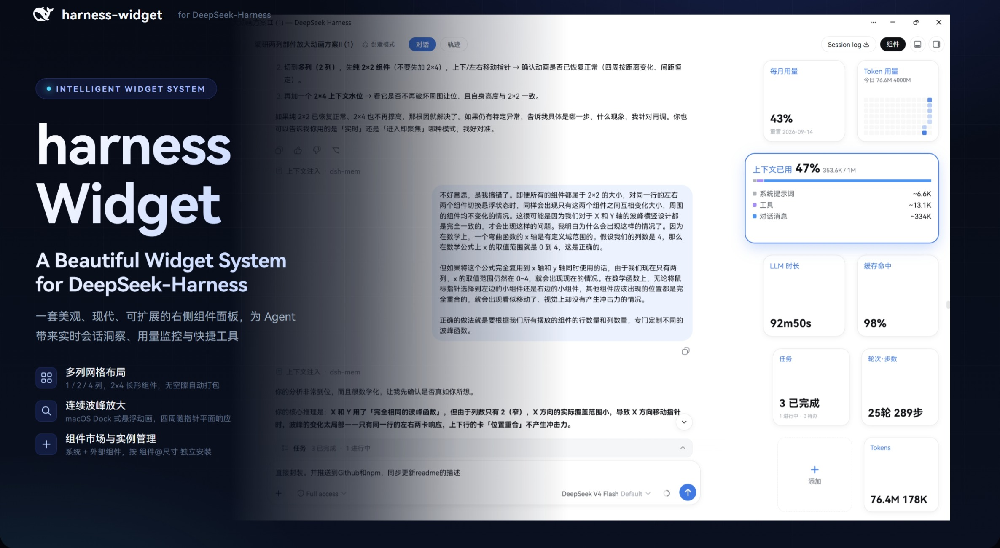

<p align="right"><a href="README.md">English</a> · <b>简体中文</b></p>

<h1 align="center">DeepSeek-Harness Widgets</h1>

<p align="center">
  <strong>为 DeepSeek Harness 打造的美观、可扩展的右侧组件系统。</strong><br>
  多列网格布局 · 2×4 长方形组件 · 连续波峰悬浮放大 · 组件市场与实例管理
</p>

<p align="center">
  
  
  <a href="https://github.com/Physicolor/dsh-widgets/stargazers"></a>
  
  
</p>

<p align="center">
  
</p>

DeepSeek-Harness Widgets 是一个基于 Cordis 的 DeepSeek Harness **持久 bundle 插件**。它在会话页右侧提供一套可定制的多列组件面板，实时展示对话洞察、用量监控与快捷工具，并通过声明式注册表支持无限扩展。

---

## 当前功能

### 多列网格布局

| 项目 | 说明 |
| --- | --- |
| 列数 | 1 / 2 / 4 列可选（设置中下拉，默认 2 列） |
| 2×4 长方形组件 | 宽度为两个 2×2 加一个间距，与 2×2 同高；同一组件可同时以两种尺寸独立安装 |
| 无空隙排列 | 组件按格自动打包（best-fit），2×4 造成的空格由后续 2×2 回填，拖动排序始终无空洞 |
| 悬浮放大 | 多列网格同样支持，放大时行/列均按平面距离让位，间距恒定 |

### 连续波峰悬浮放大

macOS Dock 式悬浮放大，提供两种模式（在 **设置 → 组件 → 无极变化** 中切换）：

- **无极变化（连续跟随）**：真正无极——每张卡片的缩放由其自身到指针的连续欧氏距离决定，指针任意移动时波峰在卡片间平滑滑动。它每一帧直接落位到稳态右对齐几何（`transition: none`），因此即使在移动中卡片右缘也恒贴 rail 右侧，不会出现宽度/位置失步导致的右缘越界。
- **离散（默认）**：复用同一套连续几何，仅把指针坐标量化到离散格点（行/列中心 + 相邻中点：2·行数−1 个 Y 点、2·列数−1 个 X 点），由 0.2s 补间在格点间平滑移动波峰。

两种模式下放大后的组件层都由悬浮层绘制在 rail 滚动裁剪盒**之外**，向左放大不吸附不截断，同时 resting rail 宽度与对话区距离始终保持不变。缩放保持正方形与恒定间距；放大倍数可在设置中调节（`1.0–1.4`）。

### 内置部件

| 部件 | 说明 |
| --- | --- |
| 轮次·步数 | 会话轮次与步骤计数 |
| LLM / 工具时长 | 推理与调用累计耗时 |
| 首 token 延迟 | 平均 TTFT |
| 速率 | 解码吞吐（tok/s） |
| 缓存命中 | 输入缓存命中比例 |
| Tokens | 输入 / 输出 token 计数 |
| 上下文水位 | 系统/工具/消息三段占比条 + 明细；支持 2×2 与 2×4 两种尺寸 |
| 一键压缩 | 上下文占用百分比 + 右下角圆钮（双击执行 compact） |
| 任务 | 进行中 / 已完成 / 待办计数 |
| 用量热度图 | GitHub 式日历热力图，自记账每日用量 |
| 今日寄语 | 随机鼓励语录，可自定义文字/对齐/换行 |

### 组件市场

- 展示全部组件（系统 + 外部），支持搜索、尺寸切换预览、按 `组件@尺寸` 独立安装；
- 已安装列表支持拖拽排序、配置编辑、`2×2 ↔ 2×4` 一键切换（自动去重，同组件同尺寸只保留一个）；
- 组件配置 tab 支持卡片级自定义（今日寄语、热度图窗口对齐等）。

### OpenCode Go 用量

滚动 / 每周 / 每月三个用量窗口 + 百分比 + 重置时间。Host 半注册同源路由代理 `opencode.ai`，浏览器不发跨域请求，密钥走 DSH credentials。

---

## 工作原理

- **部件注册表**：`WIDGETS` 声明式描述符（id / 名称 / 尺寸 / 分组 / render），部件栏与设置页共用同一注册表，新增部件只需追加一条描述符；
- **数据收集器**：挂载在 `conversation.composer.dock` slot，该 slot 仅在活跃会话存在时渲染，天然充当「会话存在」信号；
- **Host 半**：`webServer` + `credentials` 两个服务，注册 `/api/opencode-usage` 同源代理路由与 `/api/widgets-state` 状态存储（组件栏配置持久化到 `profiles/web/dsh-widgets-state.json`——权威副本，浏览器换 origin、无痕模式、站点数据被清都丢不了）；
- **可逆清理**：所有注册通过 fiber 的 effect 生命周期管理，卸载即恢复；
- **Slot 接入**：`shell.overlay`（面板）、`conversation.session.header.utilities`（胶囊开关）、`settings.section`（设置页）。

## 安装

```sh
# 通过 npm（插件市场）
dsh plugin --profile web add dsh-widgets

# 本地开发（link 方式）
dsh plugin --profile web add link:D:/dsh-home/plugins/harness-widgets
```

安装后**硬刷新浏览器**（Ctrl+Shift+R），在会话页头部点击「组件」胶囊即可展开右侧部件栏。OpenCode Go 部件需先在 Models 设置中配置 `OPENCODE_GO_API_KEY`。

## 开发

```sh
pnpm install
pnpm run build      # tsdown 构建 lib/
pnpm run check      # 类型检查 + 测试 + 构建
```

- `peerDependencies`：`@deepseek-ai/dsh-client-ui-slots`、`dsh-client-runtime`（由 DSH web profile 提供）；
- `cordis.patch.yml` 插入一行 `widgets` 行，host 半与浏览器半分别由 loader 与 client-modules 加载。

## 兼容性

- DeepSeek Harness `0.1.0-rc.6` 及兼容的后续 `0.1.x`；
- 通过 `shell.overlay` / `conversation.session.header.utilities` / `conversation.composer.dock` / `settings.section` 等官方 slot 接入；
- 与 `dsh-better-sidebar` 右栏显式协调（共用 `--dsh-sidebar-width`），卸载后无残留。

## 变更日志

### v1.1.6
**修复 — 悬浮以卡片为锚点、添加按钮随波（含位置）、进出平滑**

- **触发以卡片为准（两种模式统一）**：只有指针真正悬浮在卡片上才触发；在卡片间空隙过渡时不熄灭，且**波峰继续跟随指针滑动**（离散模式量化到格点，跨空隙移动依然变化；实时模式每帧跟随）；只有离开组件区域才停止。
- **添加按钮随波且位置一起动**：它的摆放位置从放大后的行布局重算——上方卡片变高时它随放大后的 deck 底部/最后行空隙一起下移，并在该位置按同一钟形曲线放大（此前只有尺寸缩放、位置钉在静息网格）。
- **最右侧恒对齐、间距恒一致**：悬浮层卡片的位置（top/right）全程即时；无极（realtime）跟随期**尺寸过渡整段禁用**——每帧直接落稳态 right 贴齐几何，快速移动也不会停留在非稳态中间姿态（这正是历史上右缘漂移与组件间距不一的根因）。进入/退出阶段（以及离散模式的格点滑动，其目标以格点频率变化）保留 0.15s 宽高补间实现平滑放大/缩小。
- **进出平滑无闪烁**：悬浮层常驻（透明隐藏），进入/退出放大由 CSS 尺寸过渡完成而非"挂载即目标大小"；退出同样平滑缩回静息尺寸。
- 🧪 无头浏览器实测（playwright，两种模式）：可见性按"卡片-空隙-离开"规则翻转；悬浮层最右缘与静息最右缘严格一致（diff 0）；空隙移动波峰持续变化；添加按钮随波下移（702→753px）并放大到 166px；控制台零错误。
- 🧰 **市场/配置重构——只添加、无安装/卸载分区**：所有组件本就随包内置，市场不再有"下载/卸载"：进入分组后选择具体组件，用**左右箭头**切换尺寸（不再用下拉——如 Coding Plan 的热度图/柱状图即以此切换 2×2 ↔ 2×4），点「添加」直接把 `组件@尺寸` 加进组件栏（已添加的实例显示禁用的「已添加」）。组件配置页删除了「已卸载（点击恢复或拖回上方）」区域：移除某行即彻底删除该实例（installed+order+其配置一并清除）。市场分组为**系统**（全部内置组件）、**OpenCode Go**（滚动/每周/每月用量）、**Coding Plan 用量**（热度图+柱状图）、**其它**（今日寄语，暂放、以后再分类）。
- 🧩 **市场卡片**：第一行类型名（粗体）+ 组件数量（胶囊徽章），第二行组件描述，第三行动作——不再显示 id 行。
- 🧮 **每种尺寸都是独立的市场条目**：多尺寸组件（热度图 2×2/2×4、上下文水位 2×2/2×4 等）直接作为独立组件选择——第一个 2×2、第二个 2×4——不再有右上角尺寸切换；计数徽章统计的是实例数而非组件数。
- 🎨 **预览与真实渲染同源**：预览热度图走与实时收集器相同的 `buildRollingGrid` 路径（7 行×13 列——旧预览把网格转置了，宽高画反），2×2 预览恢复正方形；今日寄语预览注入示例文本（仅预览、不落盘），不再空白。
- 🏠 **全新安装只预装文字条同款组件**（轮次·步数 / LLM 时长 / 工具调用 / 首 token 平均 / 速率 / 缓存命中 / Tokens，即官方输入框下方统计条那一组）；其余一律由市场按需添加。**已有用户的布置按设计原样保留、绝不重置。**
- 🙈 **新增个人偏好开关**（组件设置）：「隐藏输入框下方文字条」可隐藏输入框下方的官方统计条（组件栏可看同类信息）。默认关闭，留给其他用户保留文字条的选择权。
- 💬 **今日寄语未填写文本时不渲染任何内容**（去掉原先每次渲染轮换的默认文案），并暂归入「其它」分组。
- ⚠️ "已达上限"提示改为**悬浮居中 pill**，不占布局高度。
- 🧪 **升级保鲜回归**（`docs/state-fidelity.cjs`）：旧版手工布置（自定义 installed/order/cardSide/寄语文本、无新字段）加载后全部原样保留——不重置、不塞回默认，`hideStatsLine` 默认补 false；寄语无文本时零卡渲染。测试脚本会先快照 host 真实状态、结束恢复，**绝不触碰用户的已保存布置**。

### v1.1.5
**修复 — 组件状态重启后不再复位（根因：此前只存在浏览器 localStorage）**

- 组件配置（已安装 / 排序 / 各卡片自定义 / 尺寸 / 面板与放大设置）此前**只**存在每个浏览器的 `localStorage`——按 origin 隔离的浏览器级缓存。一旦浏览器 origin 变化（`localhost:3080` 与 `127.0.0.1:3080` 就是两个不同 origin）、处于无痕模式或站点数据被清、或某次写入被静默吞掉（旧 `saveState` 吞异常），配置就悄悄回到默认；而且它**永远不会跟随到另一台设备**——那台设备的浏览器里根本没有这份状态。
- ⚙️ Host 半新增 `/api/widgets-state` 路由：组件栏状态**原子写入**（临时文件 + rename）profile 数据目录下的 `profiles/web/dsh-widgets-state.json`——每台 DSH 服务一份权威副本，凡是访问到这台服务的任意浏览器/地址都共享它。
- 🔄 启动时客户端与 host 存储同步：localStorage 与 host 文件谁带的 `savedAt` 更新就听谁的，任意 origin/浏览器都会收敛到最后一次保存的配置而不是复位；每次修改双写（localStorage 即时、host 走 400ms 防抖的 PUT）。
- 🖥️ **跨标签页 + 可见性重同步**：同源多标签页里任一页保存会通过 `storage` 事件让其他页即时重读配置；切回某个标签页时重新拉取 host 存储——多开（含 localhost 与 127.0.0.1 并存）也能实时收敛，而非只在下一次启动时统一。
- 💾 既有 `harness-widgets.*` localStorage 键原样保留；Token 用量热度图账本仍按浏览器本地（它是高频记账数据），而 UI 配置从此设备级稳定。设备间按设计保持独立：每台运行自己 DSH 服务的机器各存各的状态文件（不做云同步）。
- 🧪 路由/请求体处理复用 OpenCode 代理已验证的同款写法，不引入未经验证的新契约。

### v1.1.4
**元信息 — 包改名 `dsh-widgets`**
- 📦 npm 包名 `harness-widgets` → `dsh-widgets`（符合生态 dsh- 前缀与 npm 搜索习惯），旧包已废弃并指向新包。
- 🔀 GitHub 仓库 `Physicolor/harness-widgets` → `Physicolor/dsh-widgets`（旧地址自动跳转，star/fork/issue 保留）。
- ♻️ 安装命令更新为 `dsh plugin --profile web add dsh-widgets`。
- 💾 无数据影响：localStorage 键（`harness-widgets.*`）不变，热度图与组件状态无缝迁移。

### v1.1.3
**元信息**
- 🏷️ 补充 npm `keywords`（deepseek-harness / dsh / cordis / plugin / web-ui / widgets / dashboard / heatmap），便于 npm 搜索；无代码改动。
- 🪧 GitHub topics 扩充（deepseek-harness, cordis, cordis-plugin, browser-extension, web-ui, widgets, dashboard, heatmap）。

### v1.1.2
**修复**
- 🔢 Token 用量热度图**按每个 assistant 步骤的开始时间精确入账**（v2），对不含逐节点 `usage` 的宿主自动回退「累计锚点」。某一天的格子 = 当天（本地时区）开始的所有步骤 token 总和——跨过零点的会话被正确拆到各自日期；步骤以 `turn:step:start` 去重，重挂载/会话切换/压缩重写幂等。
- 🧹 **启动即修复**：一次性清除被污染的活跃日数值（8/22 曾因固定种子与实时记账叠加显示 145M–181M）并重置去重集，让实时路径精确重建当天；标记保证只执行一次，此后实时值永不被清。
- 📚 **非活跃过去日（8/14–8/21：74.32M/367.79M/1195.70M/161.49M/292.34M/352.36M/214.85M/44.55M）** 从权威会话日志（官方差量算法、本地时间归属）回填——这些会话已结束，绝不会双计。**8/22 由实时记账累计**（约 114.87M 并随今日对话增长）。另有一次性恢复脚本 `docs/heatmap-recovery.js`。

### v1.1.1
**修复**
- 🔢 Token 用量热度图记账改为**按对话步骤精确入账**：每个 assistant 步骤只记一次，按其**开始时间**（`timing.stepStartTime`）归属日期——某一天的格子 = 当天开始的所有步骤 token 总和，告别「每日重置基线求累计差」导致的跨天误记（会话跨零点继续时会把昨天累计如 47M→117M 记进今天）。步骤以 `turn:step:start` 去重（重挂载、会话切换、压缩重写、跨天零点均正确）。对折叠表面不含逐节点 `usage` 的宿主，自动回退「累计锚点」方案——只在累计真正回落（新会话）时重建锚点，绝不在单纯换天时清零。
- ⚠️ 迁移曾把热度图表重建为仅保留演示种子（8/14–16），丢弃了其他日期的真实历史。迁移现改为**只保留 + 自动补回**：既有每日数值原样保留；**非活跃过去日（8/14–8/21，其会话已结束）**从权威会话日志按官方差量算法、按 usage 事件的**本地时间**归属回填（含 8/21 = 44.55M）。**活跃日（8/22）不播种**——由实时逐步骤记账累计，避免双计（旧版曾播种 8/22 导致 145M–181M）。一次性修复清除被污染的 8/21/8/22、重置去重集后重新回填 8/21，使 8/22 由实时累计精确重建。另有一次性恢复脚本 `docs/heatmap-recovery.js`。

### v1.1.0
**新增**
- 用量热度图支持 **2×4**：约 7 个月（30 周全滚动）网格，一次看到近半年的 Token 用量点，直接从原始日账本实时派生；网格水平居中，今日/窗口两个数字移到标题行右侧。
- 新增 **近 7 日柱状图** 组件（`heatmap-bars`，2×2）：最近 7 天垂直柱状；柱区高度与 2×2 日历图内容高度严格一致（柱子占据与日行相同的垂直空间）。

**调整**
- 柱状图横轴标签由星期改为短月日（如 `8.28`）；柱宽约 1.5 倍、圆角加大；图例为两个纯数字（今日用量 / 近 7 天用量，不带「今日/近7天」字样）；底部只标最左与最右两个日期（无 x 轴横线）。组件更名为**「用量柱状图」**（原「近7日柱状」）。
- 热度图图例去掉「今日」前缀（两个数字：今日用量 / 窗口总用量）；图表左下角与右下角分别标注窗口最早日期与今日日期。
- 2×4 热度图网格加宽（30 周）并水平居中，数字移至标题行右侧。
- 2×4 的 **Token 热度图**与**上下文水位**图表改为底部对齐（标题行右侧数字不再强制顶部对齐）。
- 组件栏顶部内边距 2px → 4px，首张卡片与 enhancer 圆角矩形顶部阴影保持间距；悬浮放大层同步。组件栏不再包含任何顶部栏规则——顶部栏的不透明矩形（遮挡组件栏顶端）由 harness-ui-enhancer 负责。

### v1.0.0
**新增**
- 设置 → 组件：新增「无极变化（连续跟随）」开关，开启后波峰每个动画帧跟随指针实时连续变化。
- 真正无极放大：每张卡片的缩放由它到指针的连续欧氏距离决定（取代离散最近卡片锚点），指针任意移动波峰均在卡片间平滑滑动。
- 离散模式复用同一套无极几何：把指针坐标量化到离散格点（行/列中心 + 相邻中点：行数→2·行数−1 个 Y 点、列数→2·列数−1 个 X 点），由 0.2s 补间在格点间平滑移动波峰；两种模式共享同一 right 贴齐姿态。

**修复**
- 悬浮放大不再撑宽 rail、不再把对话区往右推远（`--dsx-rail-w` 移除 overshoot）；放大组件向左溢出改由悬浮层绘制在 rail 滚动裁剪盒之外，不吸附、不被截断，resting rail 宽度与对话区距离保持不变。
- 悬浮层完整复刻 rail 盒模型（同 padding/box-sizing + 内层 deck），放大卡片与 resting rail 右侧垂线恒对齐，零额外命中测试成本。
- 放大时 rail 静态含添加按钮整体淡出，悬浮层在 resting 位置镜像添加按钮，悬浮中依然可见且右对齐。
- 无极模式每帧落稳态 right 对齐几何（`transition: none`）——原先的补间会让卡片在指针移动中停留在非稳态中间姿态，导致右缘越界、静止后才归位。离散模式保留 0.2s 收尾补间。

### v0.3.0
**新增**
- 多列网格布局：1 / 2 / 4 列可选（默认 2 列），支持悬浮放大。
- 2×4 长方形组件：上下文水位 2×4 版（右上角百分比 + 延展分段条）；同一组件可同时安装 2×2 与 2×4。
- 组件市场含系统组件 + 按实例（`组件@尺寸`）独立安装；已安装与预览均支持 2×2 ↔ 2×4 切换（自动去重）。
- 连续波峰动画：悬浮放大由离散阶梯改为连续指数衰减，随指针 X/Y 平面运动平滑响应。
- 无空隙排列（best-fit 打包），任意拖动顺序均不产生空洞。

**修复**
- 2×4 卡片高度错误地用宽度填充导致异常占空。
- 切换尺寸时不再重复添加，删除不再牵连同名同尺寸实例。
- 悬浮动画在水平切换峰值时上下行不响应。

### v0.2.2
- 修复今日用量跨天不重置（token 累计基准绑定日期，跨天自动清零）。

### v0.2.1
- 修复热度图数值暴涨（记账基线持久化，重挂载只计入真正新增量）。
- 修复种子升级不生效（强制覆盖，版本升至 .3）。

### v0.2.0
- macOS Dock 式悬浮放大（离散阶梯 + 布局换位）。
- 卡片级配置：今日寄语文字/对齐/换行、热度图窗口对齐方式。
- 新增部件：任务、一键压缩、上下文水位、用量热度图（自记账）、今日寄语。
- 品牌蓝标题、一键压缩按钮移至右下角。

### v0.1.1
- 部件栏背景透明、隐藏滚动条（跨浏览器）、取消上内边距。

### v0.1.0
- 右侧部件栏 + 7 个内置统计部件 + 3 个 OpenCode Go 用量部件；
- 设置 → 组件页（预览/安装/排序）；
- 进行中回合 LLM/工具时长每秒增量刷新。

## 路线图

部件注册表（`WIDGETS` 描述符）已为更多部件打好框架——新增部件只需追加一条描述符。

- **多平台用量部件**：Z.ai、DeepSeek 余额等，沿用 host 同源代理 + credentials 模式；
- **实用工具部件**：一键 compact（需接入 DSH 官方 compaction 能力）等；
- **外部接口集成**：飞书、微信等推送/交互，密钥严格走 DSH credentials；
- **部件市场**：开放第三方部件注册机制，让社区部件像插件一样入驻；
- **跨设备同步**（可选）：当前每台 DSH 服务各自维护一份 `dsh-widgets-state.json`——未来可加云/账号同步层让多台机器共享一份配置，但「本地优先、设备独立」是刻意保留的默认行为。

## License

[MIT](LICENSE)
