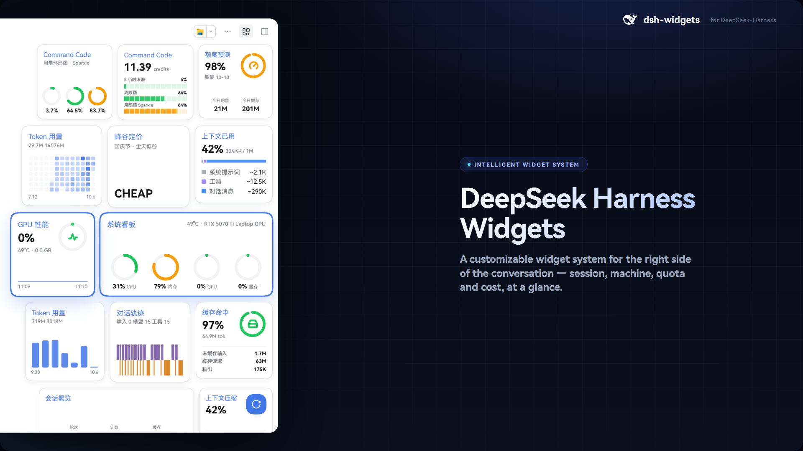
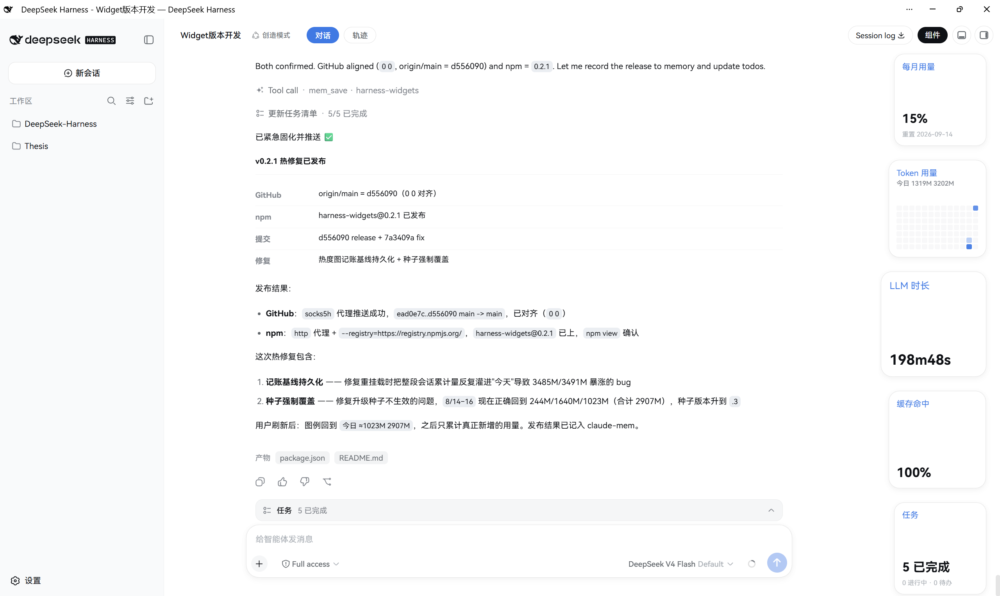
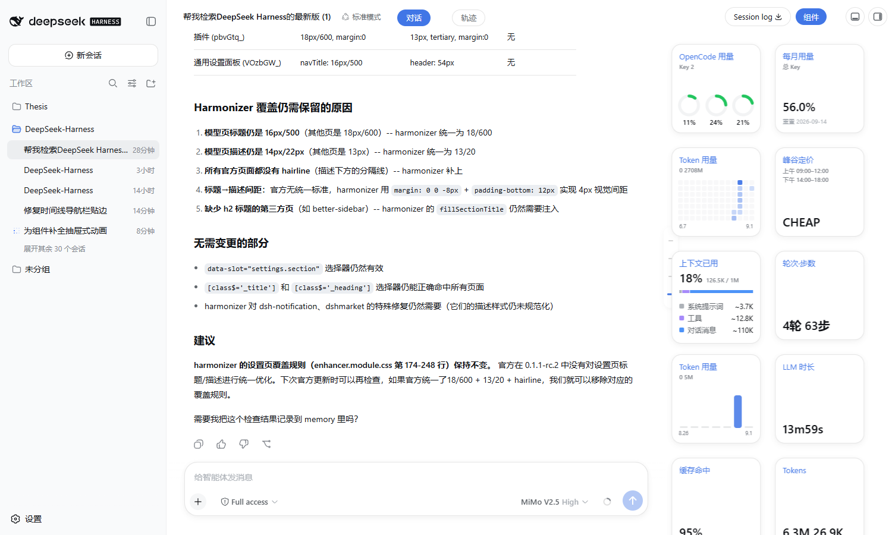

<p align="right"><a href="README.md">English</a> · <b>简体中文</b></p>

<p align="center">
  
</p>

<h1 align="center">DeepSeek-Harness Widgets</h1>

<p align="center">
  <strong>把 55 张实时看板放到 DeepSeek Harness 右侧——会话、机器、额度与成本，一眼看完。</strong><br>
  多列网格布局 · 2×4 长方形组件 · 连续波峰悬浮放大 · 每个实例独立配置
</p>

## 一条命令安装

```sh
dsh plugin --profile <你的 profile 名> add dsh-widgets
# 然后重启 dsh web，并硬刷新浏览器（Ctrl+Shift+R）
```

支持 DeepSeek Harness `0.1.0-rc.6+`（0.1.x）与 `0.2.0-rc.1+`（0.2.x）。组件栏挂在会话头部的
**组件** 胶囊按钮后面；在 设置 → **组件** 里安装、排序与调整尺寸。

## 你能得到什么

- **实时会话**——轮次·步数、上下文水位与压缩、token 与缓存命中率、LLM 时长、首 token 延迟、工具调用、后台任务与子代理；
- **钱与额度**——OpenCode Go 的滚动 / 周 / 月窗口；Command Code 的 5 小时 / 周 / 月限额，点一下即在整个 Key 池之间切换，外加余额、月末外推与今日推荐；
- **这台机器**——CPU / GPU / 内存 / 磁盘 / 网络 / 供电，含迷你折线、环形图，以及本地服务与代理出口看板；
- **你自己的视图**——每个组件都是独立单元：装它、选 2×2 或 2×4、改它的阈值，或者干脆关掉；其余由组件栏自行排布。

<p align="center">
  
  
  <a href="https://github.com/Physicolor/dsh-widgets/stargazers"></a>
  
  
</p>

<p align="center">
  
</p>

<p align="center">
  
  
</p>

DeepSeek-Harness Widgets 是一个基于 Cordis 组合模型的 DeepSeek Harness **持久 bundle 插件**。它在会话页右侧提供一套可定制的多列组件栏——实时会话洞察、用量监控与快捷操作——并配有一套可扩展的声明式注册表。

## 官网 / Showcase

项目官网位于 [`website/`](website/)，线上地址 **https://physicolor.github.io/dsh-widgets/**，是一座**设计系统站点**：讲 dsh-widgets 是什么、为什么存在、全部 55 个真实组件，以及 **DSH Widget Design Grammar**（直接取自 `src/client/index.ts` 的真实单位/间距/放大公式，并带一条交互式组件栏跑插件自己的放大曲线与右对齐回流）、**Widget Anatomy**（一张真实卡片放大 ×2，每一处内边距、间距与内缩都从 DOM 实测标注）、**DSH Visual Audit**（13 条明示规则对全部 55 个组件按真实 `getBoundingClientRect` 测量打分——规则驱动，不是模型打分）、部件单元化架构、生产 Workflow，以及「需求表 → Widget Specification」生成器。站点为纯 HTML/CSS/JS，无构建步骤，所有路径都是相对路径（适配项目 Pages 的 base path）。`node website/verify.mjs` 自校验（静态 + SEO + Edge 无头浏览器检查，共 88 项）；组件表、静态画廊 markup 与 JSON-LD `ItemList` 由 `node website/gen-site.mjs` 从各 manifest 生成（`--check` 在漂移时报错）；`node website/gen-og.mjs` 重新生成社交分享图。部署方式见 `website/README.md`。

---

## 当前功能

### 多列网格布局

| 项目 | 说明 |
| --- | --- |
| 最多列数 | 1 / 2 / 3 / 4（设置中下拉选择，默认 2 列）。这是**上限**：空间不足时自动逐级回退，空间充裕也不会超过它 |
| 卡片基准边长 | 卡片的**最小**边长（默认 150px）。组件区是流式网格：同一列数下卡片等分可用宽度，按 10px 档位放大，**上限是「5 行仍可完整显示、且最下行的底部间距等于到右边的间距」所推出的尺寸**（1578×1000 窗口下 150 → 160），超出部分归还正文 |
| 2×4 长方形组件 | 宽度为两个 2×2 加一个间距，高度与 2×2 相同；同一组件可同时以两种尺寸安装 |
| 无空隙排列 | 组件按最优适配（best-fit）打包，2×4 留下的空格由后续 2×2 回填，拖动排序永不留下空洞。3 列时若 2×4 会被「截断」，它整体前移一格、被顶掉的 2×2 后移一格（类似四舍五入），长方块不会被孤立 |
| 拖宽实时响应 | 拖动对话宽度时每帧重算可用宽度，卡片在该列数下的档位边界处立即换档（拖动期间正文内边距不做补间，与对话区同步）；列数在阈值处增减。全部为 2×4 时降级跳过 3 列（2 ⇄ 4）；显式选择 3 列则始终保留 |
| 过渡手感 | 尺寸换档与列数变化都用**轻微回弹**（约 4% 过冲的弹簧曲线）平滑放大/缩小与滑到新格子，另加一段按排布顺序错开的微型沉降波（约 1.6% 幅度、逐卡 30ms）——不是整块组件区一起「弹」。组件栏自身的宽度与对话区留白也用**同一条弹簧**，所以换档时容器、卡片、正文三者同步移动，不会出现「容器已经跳过去、卡片还在追」 |
| 悬浮放大 | 多列网格同样生效；放大时行/列都按平面距离让位，间距恒定 |
| 滚轮 = 整行挡位滚动 | 滚轮以**整行**为挡位（位移恒为 `行高 = 卡片边长 + 间距` 的整数倍），因此顶部那行永远完整、不会被截断；一档把下一行拉到顶行的位置，底部允许溢出（默认视口正好显示 5 整行 + 第 6 行的顶部小截）。滚动一律走浏览器自身的平滑滚动，**鼠标在卡片上、间隙里还是组件栏空白处都一样顺滑**，不会出现逐格硬跳 |

### 连续波峰悬浮放大

macOS Dock 式悬浮放大，两种模式（在 **设置 → 组件 → 无极变化（连续跟随）** 中切换）：

- **无极变化（连续跟随）**：真正无极——每张卡片的缩放由它自身到指针的连续欧氏距离决定，指针任意移动，波峰都在卡片之间平滑滑动。它每一帧都落位到稳态的右对齐几何（`transition: none`），因此卡片右缘在移动过程中也始终与组件栏齐平，不会出现宽度/右缘失步。
- **离散（默认）**：复用同一套连续几何，只把指针吸附到量化格点（行/列中心 + 相邻中点：Y 方向 2·行数−1 个点、X 方向 2·列数−1 个点），波峰在格点之间滑动同样由那条弹簧驱动。

波动的进度是**一条每帧写入的弹簧**：`displayed = 1 + (target − 1) · p`。`target` 是指针的实时几何，`p` 在静息（`0`）与激活（`1`）之间按 Apple 参数化曲线取值（`response 200ms`、`bounce 0.1`——约 250ms 收敛、约 0.15% 过冲 ≈0.4px）。两者都连续，因此进入、跟随、离开在两个方向上都是**一条不中断的位移**；指针继续移动只会改变 `target`，永远不会让曲线重来（此前两种写法——朴素的 CSS transition、以及冻结目标——都正是败在这里，现已全部删除）。离开用同一公式反着跑，`prefers-reduced-motion` 下一帧到位。

两种模式下，放大后的 deck 都由固定悬浮层绘制在组件栏滚动裁剪盒**之外**，因此向左放大不会被裁剪，而静息时的组件栏宽度（以及对话列距离）始终不变。缩放保持正方形卡片与恒定间距；放大倍数可在设置中调节（`1.0–1.4`）。

进出悬浮是**一次连续位移**，不是两层叠图的交叉淡入：悬浮层在静息时与真实卡片逐像素重合，因此切换发生在几何完全一致的瞬间（不可见），随后约 250ms 内把每张卡片的 top/right/width/height 与缩放一起、按同一条弹簧写入波动位置；离开时反向走回静息位置后才交换回来。被悬浮的那张卡在放大层里也保留品牌蓝描边。

进入剩下的成本是**合成层**成本、不是重绘成本，修法是一个常驻提示：放大层的 15 个槽位（以及「＋」按钮）**始终**带 `will-change: transform`，合成层在指针到达之前就已存在——把提示挂在 hover 上实测：自然进入的首帧是 63ms 的层提升 + 栅格化帧；改成常驻后同一进入是 16ms、零掉帧。过去在组件栏空闲时把放大层翻出来 64ms 的「栅格预热」已**删除**：它几乎从不与真实悬浮重合，而常驻提示一到位，那次卡顿就再没复现。

组件栏与放大层由**同一个父级统一接管指针**（两者是必须的兄弟节点：放大层要逃出组件栏的滚动裁剪盒），而且这个指针面是**几何连续**的：波动激活时放大层自身可命中、并把命中盒按「卡片向左越出的最大量」向左扩宽（左内边距同步补偿，卡片不动），所以卡片之间、卡片与间隙之间、以及放大卡片越出组件栏左缘的那一条都不会掉出指针面——否则间隙的命中会落到后面的对话上，导致「悬浮到间隙就取消悬浮」和「在边缘来回移动时反复放大缩小」。指针真正离开时才结束波动（离开判定还带 6px 容差防抖）。**在放大卡片上滚动滚轮依然滚动组件栏**（放大层在滚动容器之外，滚轮被接管为整行挡位滚动并阻止穿透到后面的对话）。

### 加载骨架

外部数据（OpenCode 用量 / Command Code / 系统监控）尚未返回时，卡片不再显示空值或 0，而是画出**它正在等待的那块内容的外形**（标题保留真实组件名，占位块为圆角填充物，带 1.5s 微光扫过，`prefers-reduced-motion` 下静止）。外形按组件定制，因此加载中的 rail 依然能看出是哪些卡：三个环形图画三个圆角方块，柱状图／折线图画一个大圆角矩形，热度图画一个宽块，数字行画它那几列短块，额度卡画三条堆叠的条；纯文字卡保留数值胶囊 + 正文行。数据返回后原地替换，卡片尺寸与位置都不跳动。

### 连续曲率圆角

卡片圆角是**超椭圆**（`corner-shape: squircle`），不是圆弧：曲率从直边连续过渡进来，这正是 iOS / Figma 式圆角矩形看起来「软」而不是「切」的原因。它是原生 CSS，所以卡片描边与 `box-shadow` 都沿同一条轮廓（用 `clip-path` 做超椭圆会把两者都切掉）；不支持 `corner-shape` 的引擎退化为普通圆角，其他行为不变。

两个控件都在 **设置 → 组件 → 组件设置**：开关（默认**开**，留着是为了能对比两种形状）与**圆角档位**——半径占卡片**短边**的比例（`12 / 16 / 20 / 24 %`，默认 16%）。用百分比而非像素，因为参照物保持的是圆角与边长的比例：150px 的卡片与放大到 190px 的副本不该拿到同样的圆角（`12%` 正好还原旧的固定 16px，边长 150 时）。该档位同时驱动组件栏的静息卡与放大卡、组件市场 / 组件配置的预览、以及加载骨架。

### 内置部件

| 部件 | 说明 |
| --- | --- |
| 轮次·步数 | 会话轮次与步骤计数 |
| LLM 时长 / 工具调用 | 推理与调用的累计耗时 |
| 首 token 平均 | 平均 TTFT |
| 速率 | 解码吞吐（tok/s） |
| 缓存命中 | 输入缓存命中比例 |
| Tokens | 输入 / 输出 token 计数 |
| 会话概览（2×4） | 把上面那排统计拆出来的会话数字并成**一张** 2×4：默认 **轮次 / LLM / 工具 / 速率**，**最多 10 个**，在组件配置里勾选与排序（`metrics` 字段：名称在左 · 开关在右 · **直接拖整行**排序，没有把手；插入指示用的是产品自己那套蓝色箭头横线）。每行最多 5 个，超过折成两行（6→3+3、8→4+4、10→5+5）。可选 12 个数字（轮次、步数、LLM、工具、TTFT、速率、缓存、输入、输出、上下文、进行、待办）走的是与单卡**同一套格式化函数**，同一个数字不会因为看哪张卡而变义；一行挤到 5 个时带不下的单位会自动退回纯数字。两个数字之间的间距就是卡片自身的内边距，与「系统监控」的环图同一套规则。2×2 单卡的大数字是 20px，看板数字是 13px——看板用来扫一排，单卡用来看一个，两者并存 |
| 上下文水位 | 系统 / 工具 / 消息三段占比条 + 明细；支持 2×2 与 2×4 |
| 系统监控 | 本机硬件族：CPU/GPU 利用率数字、内存、显存、GPU 温度——2×2 卡片 + 2×4 环形看板，另有 GPU 利用率折线 |
| 一键压缩 | 上下文占用百分比 + 角落圆钮（双击执行压缩） |
| 任务 | 进行中 / 已完成 / 待办计数 |
| 用量热度图 | GitHub 式日历热力图，自记账每日用量；2×2 = 近 3 个月日历，2×4 = 近半年全部用量点 |
| 用量柱状图 | 最近 7 天的垂直柱状图；柱区高度与日历网格一致 |
| 对话轨迹 | 官方「轨迹」三色泳道的卡片版：输入 / 模型 / 工具 每触发一次画一根色条，随模型调用工具在最近 30 拍窗口里向右滚动。**横向几何与官方时间轴一致**：圆角 1px、间隔 `min(条宽×8%, 1px)`、不足 2px 按 2px 画，三条泳道始终都在（该泳道这一窗口内没有拍就是空轨道）；**纵向按卡片**：三条泳道彼此贴紧、整体撑满灰色子标题到卡片内边距之间的全部高度（官方在 1300px 宽条上是 8px 条高 / 14px 间距，照搬到 160px 卡片会空掉三分之二）。**泳道宽度**可在组件配置里切换，对应官方工具栏的「时长」开关：`按时长`（默认，条宽 = 该拍耗时占窗口总时长的比例，空档被压缩掉）或 `等宽`（官方默认投影，一拍一格、等宽，槽位在 30 拍时冻结、不再随窗口滚动重算） |
| 今日寄语 | 随机鼓励语录；文字/对齐/换行可自定义 |
| OpenCode Go 用量 | 用量对比（三窗口柱状图）/ 用量环图（三窗口环形图）/ 滚动用量 / 每周用量 / 每月用量 |
| Command Code 账户用量 | 账户 / 用量（`4.9M tokens` 大字 + 底部 请求 · 成功率 · 消费 三栏）/ 额度（`69.16 credits` 大字 + 官网那套 5 小时 · 周 · 月 三条分段横条）/ 窗口 / 套餐（等级徽标 + 账期行），以及 5h 窗口 / 周窗口 / 月窗口三张单窗口数字卡 |
| 额度管理 | 2×2 月窗口版式：月末用量预测 + 今日用量 / 今日推荐 |
| 峰谷定价 | 仅 2×2：当前是否处于 DeepSeek 高峰计费时段（周末与中国法定节假日全天低谷） |

### 组件预览即卡面

组件市场与「组件配置」的预览把卡片钉在一个 unit 正方形里（`pinBox`），所见即轨道上落座的卡面：内容过高的卡片由卡片自身的 `overflow: hidden` 裁掉，而不是把预览台撑成一个非正方形的圆角矩形（额度卡改造前实测 200×250）。**没有多余的角色词**：数字自带单位（`4.9M tokens`、`69.16 credits`）或自带名字（等级徽标）的卡片，灰字行留给多池时的当前视图。

### 套餐卡（等级徽标 + 账期）

大数字是官方套餐表的**等级徽标**（`individual-goat` → GOAT、`individual-pro-v1` → PRO …，与 provider 一样按最长前缀解析），不再打印原始 plan id（旧的 `individual-goa…` 直接顶出卡片边缘）；图例行是**账期**，徽标落座卡片底部左下角。组件市场的预览点击会走完整条等级阶梯（GOAT → PRO → MAX → ULTRA → PROVIDER → GO → TEAMS PRO），没有那个套餐也能先看效果。

### Command Code 账户池（点卡片切换账户）

Command Code provider 的「账户轮换」卡片可以把多个订阅挂在一个安装下（`COMMANDCODE_API_KEY`、`COMMANDCODE_API_KEY_2` … `_4`）。host 侧的同源路由 `/api/commandcode-usage` **把每一把已配置的 Key 都读一遍**（各自四个官方端点），连同每个 Key 自己 `/alpha/whoami` 读到的账户名一起下发：

- **点任意一张 Command Code 卡片即可循环**：`AllUser → Physicolor → Sparxie → AllUser`。选择按卡片实例持久化在 `cardConfigs.ccView`，刷新不丢；它与 OpenCode 池的 `poolView` 是两个字段，两族互不干扰；
- **`AllUser` 是整池合计**，逐字段相加：窗口百分比 = `Σused / Σcap`（不能取百分比均值——一个用尽的池 + 一个没动的池，那是「用掉一半额度」，不是「每个池各用一半」）；月窗口按各成员自身的月窗口相加，**每个成员用自己套餐的额度**计量，所以两个 GOAT 池就是 2 × $70；账户卡在合计视图里显示通用标签 `AllUser`，底下一行列出各账户名。`AllUser` 是刻意的中英同形表达；
- **图例行带出当前视图**（`账户 · AllUser`、`窗口 · Physicolor`），与卡片角色词并列；悬停提示给出完整循环链；
- **只配置一把 Key → 完全没有切换器**：卡片与改动前逐像素一致（图例行只剩角色词，账户名回到正文）。两个池解析出同一个账户名时，用 Key 的尾 4 位区分。

### 额度管理（Coding Plan 分组，2×2）

蓝色标题在顶，**大数字（月末用量预测百分比）在标题下方一行**，灰色子标题（`账期 10-10`）在大数字**右侧**、**底边与大数字对齐**，底部两个数字：**今日用量**（实测 token）与**今日推荐**（把剩余额度均摊到剩余天数得到的每日上限）。这套「大数字在标题下、灰字在右侧」的版式与「上下文已用」卡一致；标题与大数字之间是标准 4px 间距（150px 卡）。**头部不再显示池视图名**：点击卡片照旧在 `AllUser → 账户…` 之间切换（数字跟着变），只是不再有那一行标签。

- **口径（只算这个套餐自己）**：今日用量与今日推荐都按 Command Code 的 provider 路由（`commandcode`）折出来的每日日志计算（`/api/widgets-usage-daily?provider=commandcode`），与 credits、账期同源。同一台机器上并行跑着的其它 provider（例如 OpenCode Go）当天的 token **不计入**——否则会把别人的用量算进这份套餐的额度（实测 2026-09-20：全机器 783M 里 474M 属该路由）。带口径的地图拿不到时两个数字显示 `—`，不会退回混合口径。
- **预测口径**：`已用% + 近期速率 × 剩余天数`，近期速率取**最近 3 个日当量**（前 2 个完整天 + 今天按已过比例折算）。因此预测与今日推荐**数学同调**：预测 > 100% ⇔ 近期速率 > 今日推荐速率——卡片绝不会一边说「今天没超推荐」一边说「整月超 100%」。
- **超过 100%**：数字本身变红并做 1.6s 呼吸闪烁，而不是卡片四周泛起红色光晕。
- **额度 → token 换算**：余额（credits）按本账期已实现的「本地 token ÷ 消耗 credits」汇率折算成 token，两个数字同口径；不混入 provider 自己的 token 计数（它对同一账期的计量约高 1.7 倍）。**新加的池成员本账期一分未花时没有自己的汇率**，此时预算借用整池已实现的汇率（剩余额度 ÷ 剩余天数仍然成立），而速率侧保持它自己的 0——本地日志是整台机器的，不会算到没出过力的账号头上。
- **永远不打印「数据不足」，缺什么就填什么**：还没拿到载荷 → 大数字 `-%`，能读到账期就照常显示账期，两个数字走 `—`；账期太年轻推不出预测（今天刚开的池成员）→ 显示它真实的已用百分比（0.0%）、真实预算与 0 用量；从未用过的成员 → 除了预算全是 0。只有「账期已结束」这类过期载荷才什么都不显示，因为它不再描述任何可花的东西。

### GitHub

市场里新增一个 `GitHub` 分组，五张卡由**一条** host 同源路由撑起——`GET /api/github?user=<登录名>&repos=<owner/name,…>`，浏览器不直连 `api.github.com`。凭据按三级阶梯解析，这就是它在**任何人**机器上零配置可用的原因：`credentials.resolve('GITHUB_TOKEN' | 'GH_TOKEN')` → 本机 `gh auth token`（跑过一次 `gh auth login` 就有）→ 匿名。两片数据各自在 host 侧缓存（日历 30 分钟、仓库脉搏 15 分钟），因为匿名 GitHub 是**每个出口 IP 60 次/小时**，与机器上其他 GitHub 工具共享。

两个配置项都可以留空：`user` 留空 = 「本机登录的那个账号」（从 token 自己的 `GET /user` 解析），`repos` 留空 = 该 token 能看到的最远推送的四个仓库。

| 组件 | 说明 |
| --- | --- |
| 提交热度图（2×2 / 2×4） | GitHub 同款 5 级绿色阶，颜色从 `--dsw-alias-state-success-primary` 派生（不是硬编码 hex），跟随亮/暗主题；复用 Token 日历同一个渲染器（新增 `heatmapPalette: 'github'`）。**2×2 = 近 3 个月（13 个周列），2×4 = 近一年（53 个）**，即 GitHub 个人页表头那个窗口。有 token 时走官方 GraphQL `contributionsCollection`（一次调用拿到逐日精确条数），没有则抓公开贡献页解析——两条路逐日结果已实测一致（`docs/probe-github.mjs`，两种阶梯各跑一遍）。 |
| Stars（2×2） | 大数字是 stars，标题下是仓库名，副行是 forks |
| 问题（2×2） | 未关闭 Issue，**不含 PR**（仓库字段的 `open_issues_count` 两者都算），副行是其中没有任何人回复的数量——这一项需要 token，没有时如实说明，而不是打一个没人测过的 0 |
| 提交（2×2） | 距最近一次 push 多久（`12s / 5m / 3h / 6d`），副行是最新 Release tag |
| 仓库脉搏（2×4） | Stars / 未关闭 Issue / 未回复 / 最近提交 并排，标题行给出仓库全名与最新 Release |

监控多个仓库时，每张仓库卡都带同一个点击循环（`ghRepo`），点任意一张就切换整个家族——与用量 / Command Code 的池切换同一套行为。

### 组件市场

- 浏览全部组件（系统 + 外部）、搜索、尺寸切换预览、按 `组件@尺寸` 安装；
- 已安装列表支持拖动排序、配置编辑，以及 `2×2 ↔ 2×4` 一键切换（自动去重——同一组件同一尺寸只保留一个实例）；
- 组件配置 tab 支持卡片级自定义（今日寄语、热度图窗口对齐等）。

### OpenCode Go 用量

滚动 / 每周 / 每月三个用量窗口 + 百分比 + 重置时间。Host 半注册同源路由代理 `opencode.ai`；浏览器不发任何跨域请求，密钥走 DSH credentials。两种呈现：**用量对比**（三窗口柱状图）与**用量环图**（三窗口环形图——环中心百分比、悬停显示精确值、按同一紧急度配色）。

### 峰谷定价（市场组件）

仅 2×2 的峰谷定价卡片，显示当前是否处于 DeepSeek 高峰计费时段。高峰时段（北京时间 UTC+8）为周一至周五 **09:00–12:00** 与 **14:00–18:00**——按[官方定价页](https://api-docs.deepseek.com/quick_start/pricing)的说明，其余时间一律为低峰，**中国法定节假日全天**（不是「工作日之外才便宜」）以及调休上班的周末同样按低谷计费。后半句不是细节：只看工作日时钟，2026 年会把 **19 天**当成高峰报价（元旦 1/1–1/2、春节 2/16–2/20 与 2/23、清明 4/6、劳动节 5/1 与 5/4–5/5、端午 6/19、中秋 9/25、国庆 10/1–10/2 与 10/5–10/7）。低峰显示 **CHEAP**；处于高峰窗口时显示 **EXPENSIVE**，数字本身变红并做 1.6s 呼吸闪烁（文字级告警，卡片边框保持干净），同时标题下方对应的时段行亮起品牌蓝并微微放大。整天低谷的日子，标题下的计量行直接写明原因（`中秋节 · 全天低谷` / `周末 · 全天低谷`），而不是点亮一个根本不生效的时段。以上全部可按卡片配置：高峰时段、周末/节假日开关、时区（`北京 UTC+8` 或本机时区），以及一个**额外低谷日**列表（用于国务院尚未公布下一年放假安排的年份）——这种年份卡片会退回「工作日 + 周末」判断，并把这件事写进悬停提示，而不是猜。法定假期区间放在 [`src/widgets/peak-pricing/holidays.ts`](src/widgets/peak-pricing/holidays.ts)，整套规则由 `docs/verify-peak-pricing.cjs` 复核（34 条断言）。

---

## 工作原理

- **部件单元 + 构建期发现（ARCH-001）**：每个部件都是 [`src/widgets/<id>/`](src/widgets/) 下的独立单元——`manifest.json`（机器可读的那一半：id / order / group / builtin / defaultInstalled / sizes / 该部件的 locale，另可选 `source` 与 `skeleton`）+ `index.ts`（`defineWidget` 描述符：**纯数据**的 `render()`、名称/描述 thunk、configSchema、example）。注册表是**生成**的，从不手工维护：[`scripts/gen-registry.mjs`](scripts/gen-registry.mjs) 扫描各单元目录、拒绝未知 manifest 键与 id 三处不一致，并产出 `src/client/generated.registry.ts`（`WIDGETS` / `WIDGET_RUNTIME` / `ALL_IDS` / `ALL_INSTANCES` / `STATS_WIDGET_IDS` / `DEFAULT_INSTALLED` / 合并后的 `WIDGET_LOCALES`）。新增一个部件 = 新增一个单元目录；`pnpm build` 会重新生成，注册表过期时 `pnpm check:registry` 会直接报错。部件模板放在 [`src/widgets-template/`](src/widgets-template/)——在扫描根之外，因此永远不会被发现或注册；
- **契约**：[`src/client/lib/contract/`](src/client/lib/contract/)——`types.ts`（单元 / 渲染层 / 外壳之间交换的全部形状，**零 import**：只想要类型的消费方不会把 i18n 或 React 拖进自己的模块图）+ `helpers.ts`（`defineWidget`、标签解析器、实例键、`sizesOf`）。其余与框架无关的工具并排放在 `lib/` 下（`format.ts`、`heatmap-accounting.ts`、`quota-math.ts`、`morph-spring.ts`）；某个数据源的载荷解析与该源的卡片渲染在 `src/client/families/<族>/{data,renders}.ts`，族与族之间互不引用；
- **按部件 i18n**：部件文案放在各单元的 `manifest.json`（同族共用文案放 `src/widgets/_shared/locales.json` 一次）；外壳字典（`src/client/i18n.ts`）只管外壳 UI。生成的注册表把一切合并，外壳在 apply() 时向官方 locale 服务注册；
- **组件栏由三个模块构成**：`rail/geometry.ts`（空间与预算解算，纯计算）、`rail/measure.ts`（锚点探针、宽度跟踪、ResizeObserver 扇出与让位节拍——直接写 DOM，因此不会比 React 的提交晚一帧）、`rail/rail-view.tsx`（`createRailView(deps)`：网格、放大波、加号面板与滑动抽屉）。`client/index.ts` 只做装配——bridge、四个槽位注册、页头胶囊与设置页（308 行）；
- **放大波**：曲线在 `lib/morph-spring.ts`（`WAVE_SPRING`），布局与比例场在 `rail/wave/wave-geometry.ts`，交互与逐帧写样式在 `rail/wave/RailWave.tsx`；
- **数据收集器**：挂载在 `conversation.composer.dock` slot，该 slot 仅在存在活跃会话时渲染——天然的「会话存活」信号；
- **Host 半**：[`src/host/`](src/host/)——一个上游渠道一个模块（`opencode` / `commandcode` / `usage-daily` / `github` / `sysinfo`）外加状态文件，共用 `host/http.ts`（memo 与请求体读取）、`host/exec.ts`（唯一的子进程缝）与 `host/context.ts`（ctx 契约）。[`src/index.ts`](src/index.ts) 是 31 行，只组装 `HOST_ROUTES`。路由：`/api/opencode-usage`、`/api/opencode-usage-multi`、`/api/commandcode-usage`、`/api/widgets-usage-daily`、`/api/github`、`/api/widgets-state`（组件栏配置的权威副本，持久化到 `profiles/web/dsh-widgets-state.json`——浏览器换 origin、无痕模式、清除站点数据都丢不了）与 `/api/sysinfo`；
- **可逆清理**：所有注册都由 fiber 的 effect 生命周期管理；卸载即完全恢复；
- **Slot 接入**：`conversation.input.overlay`（组件栏抽屉、放大浮层与设置抽屉——刻意放进对话子树，它会画在官方右栏面板**之下**，面板因此能吞掉组件栏）、`conversation.session.header.utilities`（「组件」胶囊，注册在 `order: 5`，避免与 `dsh-better-sidebar` 的底部面板开关撞号而换位）、`conversation.composer.dock`（数据收集器）、`settings.section`（设置页）；
- **空间契约**：组件栏从不索取固定宽度。它的预算是「官方对话列宽 − 官方正文 measure − 74px 盒内缩」，两个数都读产品自己发布的变量并带几何回退；在预算内它是一个流式网格（`repeat(auto-fill, minmax(基准边长, 1fr))` 的语义：列数按基准边长自动填充、上限为用户设置；卡片边长 = 该列数下的等分宽度，按 10px 档位量化，夹在自动下限与「5 行可见」上限之间），因此正文始终保住产品自己的 measure。空间连单列都放不下时才让位。实测见 [CHANGELOG.md](CHANGELOG.md)。

## 安装

```sh
# 通过 npm（插件市场）
dsh plugin --profile web add dsh-widgets

# 本地开发（link 方式）
dsh plugin --profile web add link:D:/dsh-home/plugins/dsh-widgets
```

安装后**硬刷新浏览器**（Ctrl+Shift+R），在会话页头部点击「组件」胶囊即可展开组件栏。OpenCode Go 部件需先在 Models 设置中配置 `OPENCODE_GO_API_KEY`。

## 开发

```sh
pnpm install
pnpm run build       # gen-registry + tsdown 打包 + 发布用 .d.ts
pnpm run check       # 注册表最新性守卫 + tsc --noEmit（0 错）
pnpm run check:types # 用一个真实消费方验证两个入口的类型能解析
pnpm check:registry  # 仅注册表发现守卫
node scripts/validate-widget-unit.mjs [dir]   # 部件单元契约校验器（Worker 自检 / 评审）
```

> **本仓库类型检查是干净的**，所以 `pnpm check` 是硬门；另有八个离线闸门守着每一次改动：G1 注册表过期、G2 单元契约与文案完整性、G3 类型检查、G4 每个部件 × 每个尺寸 × 每个预览状态的 **110 份渲染输出**（纯数据，不需要浏览器、不需要 React）、G5 编译后 CSS 的拼接、G6 纯搬移的增删行审计、G7 用桩驱动**构建产物**跑完 14 个 host 路由案例（不需要起服务）、G8 用一个真实消费方解析发布出去的声明。哪里实现什么，看 [`docs/architecture/CODE_MAP.md`](docs/architecture/CODE_MAP.md)；每一步用什么证明「没改行为」，看 [`docs/architecture/ARCHITECTURE_REFACTOR_REPORT.md`](docs/architecture/ARCHITECTURE_REFACTOR_REPORT.md)。

- `peerDependencies`：`@deepseek-ai/cordis`、`@deepseek-ai/dsh-client-ui-slots`（由 DSH web profile 提供；`@deepseek-ai/dsh-client-runtime` 已在 DSH 0.1.5 退役）；
- `cordis.patch.yml` 插入一行 `widgets`；host 半与浏览器半分别由 loader 与 client-modules 加载。

## 兼容性

- DeepSeek Harness `0.1.0-rc.6` 起的 `0.1.x`，以及 `0.2.0-rc.1` 起的 `0.2.x`（实测：**0.1.7-rc.2** 与 **0.2.0-rc.2** 上安装、启动、`settings.section` 渲染均通过；0.2 之前旧的 peer 声明会被运行时兼容检查直接拒装）；
- 通过 `conversation.input.overlay` / `conversation.session.header.utilities` / `conversation.composer.dock` / `settings.section` 接入；
- 与 `dsh-better-sidebar` 的右栏显式协调：组件栏读取官方右栏列（旧版 better-sidebar 的 `--dsh-sidebar-width` 保留为回退），页头胶囊注册在 `order: 5`，因此 bundle 重载不会让两个开关互换位置；卸载后无残留。

## 发布

每个版本的逐条记录——连同每条改动背后的实测数据——都在 **[`CHANGELOG.md`](CHANGELOG.md)**（[中文](CHANGELOG.zh-CN.md)）；每个版本同时以 [GitHub Release](https://github.com/Physicolor/dsh-widgets/releases) 发布，锚定到实际发布它的那个 commit。原始证据（CDP 探针、截图、JSON 回执、逐事件的修复记录）在 [`docs/`](docs/) 下。本 README 只保留当前版本的速览。

### 最新版本 — v1.8.1

**两批新卡片、一套统一的头部阶梯，以及只有在真实组件栏上才会暴露的缺陷。** v1.8.0 是工程版本，这一版把它腾出来的空间用掉：注册表从 **40 个部件单元长到 55 个**（新增 17、退役 2，分三批落地），再加上一批排版收口，以及两个直到全部上屏才被看见的问题。

- **17 个新单元，合计 55 个。** 会话与机器批：**目标进度**（阶段、目标、轮次）、**守卫**（当前生效的权限档）、**任务**（后台作业）、**子代理**（已派发的子代理与可续跑数）、**磁盘**（剩余空间 + 会话日志体积与近一小时增量）、**窗口预测**（5h / 周窗口会不会在重置前触及限额）。设备批：**网络** / **供电** / **进程**（逐网卡速率、电池与电源方案、按工作集排序的进程）、**会话成本**（用价格表给本会话 token 计价，并在旁边印出价格来源）、**待我处理**（GitHub 待审队列，ETag 感知、仅登录态）。另有 **服务**（本地端口与出口连通看板——端口在听不等于出口通）与第三批的四个：**套餐总览**、**轨迹占比**、**Token 柱状图**、**峰谷定价看板**。它们背后是新 host 通道：`/api/host/overview`（把吞吐、供电、进程、服务与代理健康合并成一次 PowerShell）、待审切片（`notif=1`）与 usage-center 价格表读取通道。同时退役两个单元：宽版柱状图并入 `heatmap-bars`，model-config 删除；
- **所有卡片头部共用同一套阶梯。** 环头现在**永远**画满三行——widget 没有的数字或灰字是**占位**，不是被丢掉——因为环是与阶梯自身高度居中的：实测（side 150）没有灰字的「套餐总览」标题/数字/环是 **15.7 / 35.3 / 13**，而有灰字的同一张卡是 **13 / 32.6 / 17.3**。`docs/probe-head-ladder.cjs` 用手写渲染输出挂载**真** `CardBody`（这是任何 widget 预览数据都到不了的状态），在两种卡片尺寸上钉住契约。同一轮还给头部加了裸 `headIcon` 角标、五档 value tone 与 20px 数字位；
- **Command Code 的月限额回来了** —— 那个让「用量环形图」少一个环、「额度」少一行月限额、「额度预测」退化成 `-%` 且今日推荐 `—` 的缺陷。`/alpha/whoami`、`/alpha/usage/summary`、`/alpha/billing/subscriptions` 实测 **14–21 秒**，而 host 给四个切片共用 8 秒预算，于是每一次轮询它们都被丢掉。现在路由按切片规划（快的 `credits` 照旧 await，慢的三个按各自 TTL 在后台刷新）、刷新失败保留上一个好值、宿主启动时预热，客户端在任何降级回复后 5 秒补看一次（包括首次那份**本身就残缺**的载荷）。`docs/probe-cc-pool.mjs` 对真实上游复核了整个家族（92 条断言：池月 40.5%、单账号 78.7% / 2.1%、真实账号名）；
- **图表卡不再撑破自己的格子，仪表也不再撒谎。** 图表卡固定为格子尺寸并让图表吃掉剩余高度（改前实测：Command Code 额度卡在 160px 槽位里盒出 172.8px）；骨架屏改成格子的精确尺寸（原比真卡高 13%）；99% 的环不再读成 95%（`cappedArcInk` 改为按**绘制长度**算墨量）；额度行的格数改为按宽度推导，而不是把 24 根纸片塞进一条 132px 的槽；图表渲染器改为创建真实元素——内联调用会把它的 hooks 挂到 `CardBody` 的 fiber 上，于是一次普通的「先无图、后有图」切换会渲染出比上一轮更多的 hooks，让 DSH 的 slot 边界清空整个抽屉（React #310）；
- **16 个单元改名，改成它们真正回答的问题**（用量 → 账期用量、账户 → 账户身份、窗口 → 用量环形图、额度 → 用量柱状图、5h 窗口 → 5 小时窗口、限流预测 → 额度预测、系统监控 → 系统看板、速率 → 解码速率、首 token 平均 → 首 token 延迟、问题 → 未关闭 Issue、提交 → 最近提交……），额度行也统一成 5 小时限额 / 周限额 / 月限额；共享词典、生成的注册表与官网在同一轮里重新生成；
- **官网随版本一起走。** 55 张卡、新名字，以及 hero kicker、终端标题、页脚与 JSON-LD 里的 `v1.8.1`——`node website/verify.mjs`（88 项检查）现在会把每一处手写版本号与 `package.json` 对齐、把文案里的每个数量与 manifest 列表对齐，因为发版前审计发现结构化数据里还写着 1.6.0；
- **靠证据，不靠肉眼。** 离线卡片画廊（`node scripts/preview/gallery.mjs`）用真 `CardBody` + 真主题 token 渲染每个部件并逐格截图；G7 用纯桩离线跑完每条 host 路由（17 个案例）；`docs/probe-cc-slices.mjs` 用可控延迟的 fetch 桩证明切片流水线（13 条断言，`--live` 另打真实上游逐端点延迟）。

## 路线图

组件系统现在是为规模而建的：每个部件都是 `src/widgets/` 下独立、契约驱动的单元，并在构建期被发现——新增一个部件就是新增一个单元目录，无需改动任何共享文件（指南：`src/widgets-template/README.md`）。

- **热度图 token 口径的后续工作**：卡片的总量已经与 dsh-usage-center 一致（host 路由复用它的 `getActivity()`）。要在**未安装** usage-center 时也做到精确，就得在本 host 里折叠同一批会话日志——今天刻意不重复实现，以保持口径只在一处维护；
- **Command Code 月窗口，待上游字段**：月份由本地推出 `used = 套餐额度 − 剩余月额度`（额度取自公开套餐表），因为 `billing/credits` 不返回月窗口对象。若上游之后在 `windowLimits` 里补上 `monthly`（含 used / cap / resetAt），`monthlyWindow()` 应直接读它，推导只作为回退；
- **Command Code 池靠命名约定发现**：host 读 `COMMANDCODE_API_KEY` 以及 provider「账户轮换」卡片写下的 `_2 … _4` 备用 Key。若某把 Key 存在无关的 ref 名下，需要把该 ref 加进 `COMMANDCODE_POOL_ENVS`（credentials 服务只暴露 `resolve(ref)`，没有「列出所有 ref」的口子，无法自动枚举）；
- **Agent 生产部件**：机器可读契约（`manifest.json` + `defineWidget` 描述符 + 模板 + 共享 API）正是一个 worker agent 端到端造出一个部件所需要的一切；v1.3.0 的并行创建测试证明两个 agent 可以同时添加部件、零文件冲突；
- **更多硬件指标**：通过可选的 LibreHardwareMonitor 桥拿 CPU 温度（外部依赖、需显式开启——刻意不打包）、NVIDIA 之外的 AMD/Intel GPU 支持、按网卡的流量；
- **热度图范围/周期控制**：让 2×4 热度图与柱状图能选当前半年 / 7 天默认值之外的自定义范围（周/月等）；
- **多平台用量部件**：Z.ai、DeepSeek 余额等，复用 host 同源代理 + credentials 模式；
- **峰谷定价的节假日表，每年一次**：法定假期区间放在 `src/widgets/peak-pricing/holidays.ts`，逐条抄自国务院办公厅的年度通知（2026 年 = 国办发明电〔2025〕7号）。下一年的安排通常在前一年 11 月公布——届时补上区间并扩展 `HOLIDAY_YEARS` 即可；在此之前卡片退回「工作日 + 周末」判断、在悬停提示里说明这一点，并可用卡片级的**额外低谷日**字段补齐。同一张卡上仍待做的：工作日集合自定义（时段与时区已经可改）；
- **实用工具部件**：一键压缩（需要 DSH 官方 compaction 能力）等；
- **外部集成**：飞书 / 微信推送与交互，密钥严格走 DSH credentials；
- **部件市场**：开放第三方部件注册机制，让社区部件像插件一样入驻——单元 + 发现架构（v1.3.0）就是载体；未来的 `widgets-market` bundle 可以同样地把单元放进 `src/widgets/`；
- **更多语言**：字典层每个 key 都已有 zh/en——加 `ja`/`ko` 等纯属字典扩展；
- **跨设备同步**（可选）：今天每台 DSH 服务各存一份 `dsh-widgets-state.json`——云/账号同步层可以让多台机器共享一份配置，但「本地优先、设备独立」是刻意保留的默认行为。

## 如果它有用

这个插件除了「被搜到」之外没有任何分发渠道：如果它帮你省下了几次翻找，那么在
[Physicolor/dsh-widgets](https://github.com/Physicolor/dsh-widgets) 点一个 star，就是把它
推到 DSH 各插件目录前列、让更多人看到的那一下。Bug 与组件想法同样欢迎——
[`issues`](https://github.com/Physicolor/dsh-widgets/issues) 一直开着。

## License

[MIT](LICENSE)
