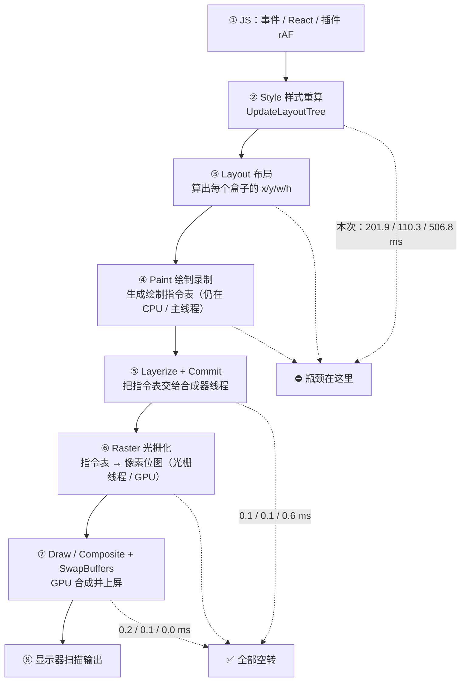

# DIAG — 为什么「组件区开合流畅、右侧边栏开合卡顿」

日期：2026-10-04
发起人：车仔面大王（m03776）
关联：`DIAG-2026-10-04-rightbar-column-transition.md`（同一问题的机制与候选修复方案）

---

## 0. 一句话结论

**卡顿不在 GPU、不在「上屏」那一段，而是在主线程的「重新计算并重新录制画面」那一段。**
实测同一次开合窗口内，主线程干了 **987 ms** 的活，合成器（compositor）只有 **0.6 ms**，GPU **0 ms**。
GPU 不是瓶颈——它是在**空转等米下锅**：主线程算不完，就交不出帧。

两个手势的差别只有一句话：

| | 动画改的东西 | 会不会让正文重新排版 |
|---|---|---|
| 组件区开合（插件） | `padding-right`（滚动容器内边距） | **不会**，正文只是整体平移 |
| 右侧边栏开合（官方） | `grid-template-columns`（三栏轨道宽度） | **会**，每一帧正文都在重新折行 |

---

## 1. 两组关键读数（同一页面、同一台机器、同一仪表）

环境：headful 1707×1067 @ deviceScaleFactor 1.5，工作区 7 个会话，右栏初始/恢复均 CLOSED。
`DOM(LayoutObjects) = 9555`——这是所有布局成本的乘数（正文视图有 9555 个布局对象）。

### 1.1 单次开合的整体画像（median）

| 手势 | frames | p95 | >33ms | 官方 RO 回调 | LoAF block | 其中强制同步布局 |
|---|---|---|---|---|---|---|
| R- 组件区关 | 139 | 19.8 | 3 | **0**（centerCol） | **0 ms** | **0 ms** |
| R+ 组件区开 | 136 | 22.1 | 3 | **0**（centerCol） | **0 ms** | **0 ms** |
| B1 右栏开 | 211 | 15.3 | 8 | **6** | **185 ms** | **158 ms** |
| B2 右栏关 | 158 | 54.9 | 9 | **6** | **231 ms** | **193 ms** |

### 1.2 逐帧几何：谁在变、谁恒定（`.tmp-rewrap.cjs`）

| 观测量 | R- 组件区关 | R+ 组件区开 | B 右侧边栏 |
|---|---|---|---|
| `centerCol` border box 宽 | **[1427] 恒定** | **[1427] 恒定** | **[1427, 784, 659]** |
| 阅读列宽 `readW` | **[748] 恒定** | **[748] 恒定** | **[748, 639, 589]** |
| 正文块高 `readH`（行数代理） | [48] | [48] | [48] |
| 转写区滚动高 `scrollH` | **[10857] 恒定** | **[10857] 恒定** | **[10857, 10905, 10929]** ← 行数真的变了 |
| 输入框宽 `inW` | **[776] 恒定** | **[776] 恒定** | **[776, 667, 617]** |
| 输入框左 `inL` | 370→600 | 600→370 | 370→296 |
| 滚动容器 padding-right | 0→460px | 0→460px | 460px→0 |

**判定**：组件区开合期间，正文列宽、滚动高度、输入框宽度**一寸都没变**——只有 `padding-right` 与整体位置在变；右侧边栏开合期间，这四项**同时在变**，滚动高度变化说明文本**真的重新折行、行数变了**。

### 1.3 合成器/GPU 归属（`.tmp-trace.cjs`，Chrome trace，独占时长）

| 配置 | 主线程 | 合成器线程 | GPU 线程 |
|---|---|---|---|
| R- 组件区关 | **487.6 ms** | 0.1 ms | 0.2 ms |
| R+ 组件区开 | **431.5 ms** | 0.1 ms | 0.1 ms |
| B 右侧边栏 | **987.0 ms** | 0.6 ms | **0 ms** |

主线程内部拆解（ms，独占）：

| 阶段 | R- 组件区关 | R+ 组件区开 | B 右侧边栏 |
|---|---|---|---|
| `UpdateLayoutTree`（样式重算） | 201.9 | 110.3 | **506.8** |
| `Layerize`（图层化） | 94.5 | 128.0 | 210.3 |
| `FunctionCall`（JS） | 106.7 | 88.9 | 98.5 |
| `Paint`（录制绘制指令） | 33.4 | 41.7 | 71.3 |
| `Layout`（几何布局） | 26.1 | 30.1 | 67.9 |
| `Commit`（交给合成器） | 7.1 | 8.8 | 19.7 |
| `RasterTask` / `GPUTask` | ≈0 | ≈0 | ≈0 |

**最大的一笔是 `UpdateLayoutTree`**——样式重算，不是布局、不是绘制、更不是光栅化。

---

## 2. 机制：一个只挪位，一个重新排版

### 2.1 组件区为什么流畅（数字可验算）

插件用的是 `body.dsx-stats-active [data-conversation-scroll] { padding-right: var(--dsx-rail-w) }`
（`src/client/styles/rail.module.css:102-110`；过渡在 `src/client/styles/card.module.css:275-281`）。

- 滚动容器的 **clientWidth（padding 盒内宽）恒 1421px**（border box 恒 1425px）；`padding-right` 从 0 涨到 **460px**，内容盒随之从 1421 缩到 **961px**。
- 但阅读列只要 **748px**。**961 > 748**，列宽不被挤压 ⇒ **正文不需要重新折行**。
- 结果：内容盒变窄只让居中的正文块**换了个居中位置**（`inL` 370↔600，滑动 ~230px），整块**平移**，而不是重排。
- 于是布局不需要往文本子树里传播，几何读数是干净的 ⇒ **centerCol 的 ResizeObserver 事件 = 0，强制同步布局 ≈ 0 ms**。

这就是它在感官上「丝滑」的根本原因：**它没有让正文重排，它只是让正文挪了个位置。**

（顺带说明：滚动容器自己的 RO 仍会响 10~15 次——padding 确实改了它的内容盒——但那些回调读到的是干净布局，代价接近 0。真正的差别是 centerCol 有没有被逐帧改宽。）

### 2.2 右侧边栏为什么卡

官方帧容器动画的是 `grid-template-columns`（插件 `dsh-ui-harmonizer` 的常驻 tween 让它真正跑起来，见上一份 DIAG）。它逐帧改的是 **centerCol 的 border box**：1427 → 784 → 659px，一帧一个离散值（实测 6 个）。

- 内容盒最终只剩 **657px < 748px** ⇒ 阅读列被压到 **589px** ⇒ **每一帧正文都要重新折行**。
- 行数变化有硬证据：`scrollHeight` 10857 → 10905 → 10929。
- 输入框也跟着变宽变窄（776 → 667 → 617），滚动的锚定、对齐、`text-wrap` 全部失效重算。
- 于是每帧都要：**样式重算（整个会话子树）→ 布局 → 录制绘制**。这就是 `UpdateLayoutTree 506.8 ms` 的来源。

### 2.3 官方测量回调把它放大成 layout thrashing

右侧边栏开合时，官方 client 自己的 ResizeObserver 被逐帧叫醒（`centerCol` 6 次）：
`Object.install (dsh-experimental-client-ui-*)` 6–7 次、`ChatViewport.attach (dsh-client-product-analytics)` 7–8 次、`observeControlRow` 4–5 次。

这些回调里做的是**同步几何读取**（`getBoundingClientRect()` 一类）。在样式已被标脏、还没到下一帧的情况下读几何，浏览器**必须当场把布局算完**才能回答——这就是 **forced synchronous layout（强制同步布局 / layout thrashing）**：

> 单次开合 **185–231 ms 的阻塞里，158–193 ms 就是强制同步布局**（约 85%）。

一层是「正文本来就得重排」这项固有成本，另一层是「回调不等下一帧、当场逼布局」这项放大成本。二者相乘，就是车主看到的掉帧。

对照上一轮更精细的逐回调归属（6 次开合）：`ResizeObserver` 合计 321 ms，其中 **official 310 ms**（`73005` 183.2 ms max 50.9、`80410` 124.8 ms max 65.3），插件侧仅 10 ms。

---

## 3. 浏览器绘制管线：从「动画」到「屏幕」到底经过什么

**车主原先的理解**——「GPU 把算好的动画画出来，传到屏幕」——**只对一类动画成立**：

- 动画属性是 **`transform` / `opacity`**，且元素已有自己的合成层 ⇒ 第一帧之后 ①~④ **全部跳过**，每帧只跑 ⑤~⑦。主线程再忙，动画照样满帧。这就是「合成器动画 / compositor-only animation」，也是业界所有「丝滑抽屉、丝滑弹窗」的做法。
- 动画属性是 **`width` / `padding` / `grid-template-columns` / `top` / `right` / `font-size` 等几何属性** ⇒ **每帧都要重跑 ①②③④**。GPU 是链路的最后一环，也是最便宜的一环；它没在忙，它在等主线程交出帧。

所以答案很明确：**这是「计算层面」的问题，不是「显示/渲染到屏幕」的问题**。具体是哪一步：主线程的 **style 重算 + layout**（`UpdateLayoutTree` 最大），由「正文逐帧重排」触发，由「回调强制同步布局」放大。

---

## 4. 业界会碰到吗？——会，而且是最经典的一类性能问题

「动画几何属性导致每帧主线程重排」是 Web 性能领域教科书级的问题，标准解法有这些：

1. **只动画 `transform` / `opacity`**（compositor-only properties）。这是 web.dev 首推的一条。任何 `width/height/top/left/margin/padding` 动画都应当在评审阶段被拦下。
2. **FLIP / 快照 + 位移**：先瞬间把布局改到位（一次性代价），再用 `transform` 把「视觉上的变化」补一段动画。抽屉、列表重排、图片展开普遍这么做。
3. **避免 layout thrashing**：读写分离、批量读、不要在写样式之后立刻读几何；优先用 `ResizeObserver` 回调里免费的 `entry.contentRect`，而不是回调里再 `getBoundingClientRect()`。
4. **限制重算范围**：`contain: layout paint size`、`content-visibility: auto`，让样式/布局只在一个子树里传播。
5. **动画期间跳过测量**：用 `transitionrun`/`transitionend` 标记 `animating`，动画期间不做昂贵测量，结束后补一次精确测量。
6. **缩小 DOM**：`LayoutObjects = 9555` 是成本乘数；长列表虚拟化能把每次重排的成本压下来一个量级。
7. **`will-change: transform`** 提升合成层（节制使用，别滥用导致显存爆炸）。
8. **抽屉类 UI 的行业惯例**：面板用 `transform` 滑动，内容列宽**不动**（或整块瞬移）。

对照本项目的现状：插件在组件区开合上**无意中做对了第 2 条**（正文不重排，只挪位）；而右侧边栏这条链路违背了第 1 条（动画几何属性）、第 3 条（官方回调用 gBCR + 插件自身的 `center-card` 也在 `measure()` 里 `col.getBoundingClientRect()`）、第 8 条。

---

## 5. 对本项目的含义：候选修复 X 就是业界标准解

上一份 DIAG 里的方案 **X = 轨道宽度瞬间到位（snap）+ 用 `transform` 合成器小卡片盖住视觉位移（304px）**，
正是第 1 条 + 第 2 条 + 第 8 条的组合：**不让正文逐帧重排，把动画搬到合成器上。**

实测画像（单次开合 median）：

| 方案 | p95 | >33ms 帧 | centerCol RO | LoAF block |
|---|---|---|---|---|
| A 现装（300ms tween，动画几何属性） | 12.5 | 8 | 37 | 272 |
| S stock 式 snap（无动画） | 10.3 | 5 | 9 | 238 |
| **X snap + 合成器 cover** | **7.9** | **3** | **9** | **227** |

注意 S 与 X 的差异：只 snap 不作 cover，内容会「啪」地跳一下（视觉上不可接受）；X 用合成器 cover 补上这 304px 的视觉位移，所以既有 snap 的主线程代价，又没有跳变。

---

## 6. 未做声称

- 未声称已修复「对话区平移卡顿」。本文只做归因：**卡顿来自主线程 style/layout，不来自 GPU/上屏**。
- trace 每配置为**单次运行**（1.5 s 窗口），且独占时长包含该窗口内与本次开合无关的主线程活动；主线程 / 合成器 / GPU 的**量级对比**是稳健的，绝对毫秒数不应逐位引用。
- 未声称组件区路径「永不掉帧」：`.tmp-pipeline.cjs` 里 R+ 一轮出现 p95 104.8 ms / 12 帧 >33 ms，来源是 `refreshMaterial`、`ae`、定时器等**与 rail 无关**的主线程活动。组件区开合在**结构上**便宜（0 次 centerCol 回调、≈0 ms 强制布局），不代表整机会一直满帧。
- 未修改官方 shell 任何一个字节；插件侧本轮只改探针。

---

## 7. 证据文件清单

| 文件 | 内容 |
|---|---|
| `scripts/.tmp-compare-toggles.cjs` → `.probe-compare-toggles/compare-toggles.json` | 同页同仪表对比两种开合：RO 回调站点、transition 事件、LoAF block/forced、centerCol 离散宽度 |
| `scripts/.tmp-compare-scroller.cjs` → `.probe-compare-scroller/compare-scroller.json` | 逐 rAF 采 paddingRight / clientWidth / border-box / centerCol 宽；判定 padding 不进入 content-box |
| `scripts/.tmp-rewrap.cjs` → `.probe-rewrap/rewrap.json` | 逐 rAF 采最内侧正文块的 width/left/height、输入框 width/left、scrollHeight；判定「平移 vs 重排」 |
| `scripts/.tmp-pipeline.cjs` → `.probe-pipeline/pipeline.json` | CDP `Performance.getMetrics` 增量（Layout/RecalcStyle/Script/Task）+ LoAF 强制布局占比 |
| `scripts/.tmp-trace.cjs` → `.probe-trace/trace.json` | Chrome trace 按进程/线程分桶的**独占**时长：主线程 vs 合成器 vs GPU，以及 UpdateLayoutTree/Layout/Paint/Commit/Raster 明细 |
